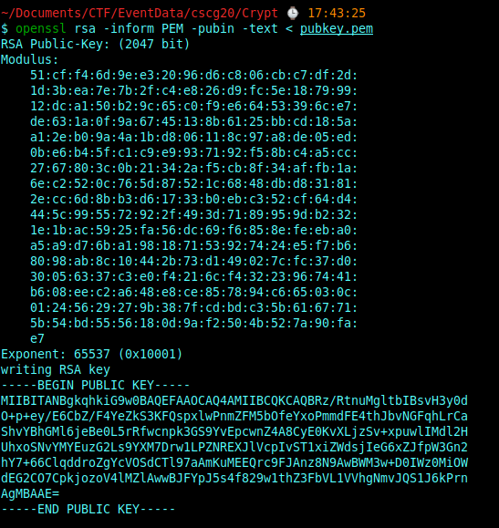
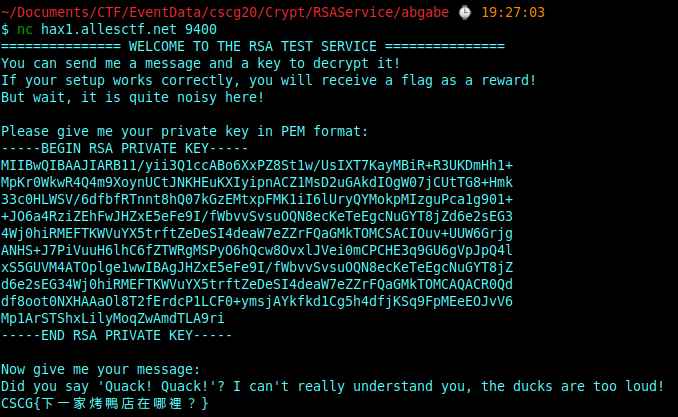

# Cryptography

## Intro to Crypto 1

**Challenge**

"This is an introductory challenge for beginners which want to dive into the world of Cryptography. The three stages of this challenge will increase in difficulty. For an introduction to the first challenge visit the authors step by step guide."

For this challenge we get an encrypted message **"message.txt"** and a public key **"pubkey.pem"**

**Solution**

The **"pubkey.pem"**-file is a RSA-public key.
My first idea was to look at the rsa modulus, maybe weak prime numbers were used.

I have used the following commands to extract the modolus N: 

```
HEX_MODULUS=$(openssl rsa -pubin -in pubkey2.pem -modulus | grep 'Modulus=' |  cut -d'=' -f 2)
echo $HEX_MODULUS
```

You can also use **"openssl rsa -inform PEM -pubin -text < pubkey.pem"** and online converters for **"pem to hex"** and **"hex to decimal"**, to get the modulus as a decimal number (https://holtstrom.com/michael/tools/hextopem.php and https://www.rapidtables.com/convert/number/hex-to-decimal.html)



We get the following modulus 
**N = 10327849034940138613515485956077213322791085874638285662823764630659653931824178919168344401508423966366637831067655701114352106747323628144645384205073278784870804834942988268503504130770762781798270763453272421050209487483563600870343875197428105079394315585993355808937811229959083289653056248770988647762812998870912510238393368777882358059256678052653963583286245796285737035786447522814310717433588049686223718247661713594680120785280795132759253149754143640871380226770164628599577669124463514838464342769690232097283333816896581904763736283142031118073027496197756777460403007359764250621763279762041468943079**

and the public exponent 
**e = 65537**

The RSA encryption works as follows:
1. chosen two prime p, q we calculate N = p*q
2. We calculate the modulus qhi(N) = (p-1)*(q-1)
3. Now chose 3 <= e < phi(N) and calculate d with 1 = e * d mod phi(N)
4. The public key is now (e,N) and the private key is now (d,N). 
5. ciphertexts c are calulated with: c = plaintext^e mod N
6. decrypt a ciphertext c with: plaintext = c^d mod N 

If we know the modulus phi(N), we can calulate the inverse element of e, which is d. Thus we can calulate the private key if we know phi(N). 

We can take a look at factorDB and find out if we can calculate the prime factors p and q (N = p*q):
And yes we have a result in a second: 

**q = 16584235167731787847013470803061277015678956556694867873072487447887926204573222554710220299137896151698893829263470795092022504576184748229461509022182668168932373990476110465504678644868916760949835108178505407538822880225906663932043264799941076095252059950113859004542443496612744563482124073298940744796576800151123820336528353672466777346414021097764537645521638337450661718385755338513002335497796149161099248732899206255277182670571055097076123763356692547858422108949105868315872104780985522044066316665393121965734834334905254114025888811325924997427587424504748731773056980012499780203906986519558329**

**p = 622751**

Now we are able to calculate the inverse to our exponent **d = e^-1 mod phi(N)** where **phi(N) = (q-1) * (p-1)**.
Knowing **d** allows us to decrypt the given message.txt (d is the unknown part of the private key).
As described above, for decrypting a message we have to calculate: **plaintext = ciphertext^d mod N**
Now if we convert the result into a string we get the flag: **CSCG{factorizing\_the\_key=pr0f1t}**

I have used the following python script to calculate the flag:

```
import gmpy2
#import binascii
import os
import Crypto.Util.number as number

f = open('message.txt', 'r')
cipher = gmpy2.mpz(f.read())
N = 10327849034940138613515485956077213322791085874638285662823764630659653931824178919168344401508423966366637831067655701114352106747323628144645384205073278784870804834942988268503504130770762781798270763453272421050209487483563600870343875197428105079394315585993355808937811229959083289653056248770988647762812998870912510238393368777882358059256678052653963583286245796285737035786447522814310717433588049686223718247661713594680120785280795132759253149754143640871380226770164628599577669124463514838464342769690232097283333816896581904763736283142031118073027496197756777460403007359764250621763279762041468943079 
e = 65537
q = 16584235167731787847013470803061277015678956556694867873072487447887926204573222554710220299137896151698893829263470795092022504576184748229461509022182668168932373990476110465504678644868916760949835108178505407538822880225906663932043264799941076095252059950113859004542443496612744563482124073298940744796576800151123820336528353672466777346414021097764537645521638337450661718385755338513002335497796149161099248732899206255277182670571055097076123763356692547858422108949105868315872104780985522044066316665393121965734834334905254114025888811325924997427587424504748731773056980012499780203906986519558329
p = 622751
phi = (p-1)*(q-1)
d = gmpy2.divm(1,e,phi)

plaintext = gmpy2.powmod(cipher, d, N)
print(number.long_to_bytes(plaintext).decode())
```


## Intro to Crypto 2

**Challenge**

This is an introductory challenge for beginners which want to dive into the world of Cryptography. The three stages of this challenge will increase in difficulty.
I learned my lesson from the mistakes made in the last challenge! Now p and q are huge, I promise!


For this challenge we get an encrypted message **"message.txt"** and a public key **"pubkey.pem"**

**Solution**

The **"pubkey.pem"**-file is a RSA-public key.
This challenge is similar to "Intro to Crypto 1".

I have used the following commands to extract the modolus N: 

```
HEX_MODULUS=$(openssl rsa -pubin -in pubkey2.pem -modulus | grep 'Modulus=' |  cut -d'=' -f 2)
echo $HEX_MODULUS
```

You can also use **"openssl rsa -inform PEM -pubin -text < pubkey.pem"** and online converters for **"pem to hex"** and **"hex to decimal"**, to get the modulus as a decimal number (https://holtstrom.com/michael/tools/hextopem.php and https://www.rapidtables.com/convert/number/hex-to-decimal.html)

We get the following two numbers:

 **N = 11081631875903145989449935723431993312048263659503073501368579288661507666926127398551161494057149306128113773163942639308834214121175806650609216999457699806761832905200688030797211656004392019494461369905299150414106039926917206543955359193966893148964232596310365304968051716316421386564037673515738090636958039103706945349258789436043666088184674948218539196263599899299117746103356732914111330139176914363944699056706536973601851519543254647327613986429683489937828404640743341705415177790924588759219148196121101333618974290049804819348181073769764832469557718828674823915162708288827812462173689965257895702511**
 
 **e = 65537**
 
 The challange description says: “I learned my lesson from the mistakes made in the last challenge! Now p and q are huge, I promise!”. Lets see if this is correct. 
 Again i have asked factorDB ( “http://factordb.com/index.php”) and https://www.alpertron.com.ar/ECM.HTM. And it seems that we have two primes which are relativly close. 

 **p = 105269330176947292996638200435938306898008923026214454261833875185727477089897046111427146733705930821830266909665628457524081078905360676252447567252776868229878866771906188152589974886284283170888631961882151644823439854179072943695999068501018297820499189273623372907923121271707038222250931356234064474919**
 
 **q = 105269330176947292996638200435938306898008923026214454261833875185727477089897046111427146733705930821830266909665628457524081078905360676252447567252776868229878866771906188152589974886284283170888631961882151644823439854179072943695999068501018297820499189273623372907923121271707038222250931356234064574969**

Now we are able to calculate the inverse to our exponent **d = e^-1 mod phi(N)** where **phi(N) = (q-1) * (p-1)**.
Knowing **d** allows us to decrypt the given message.txt (d is the unknown part of the private key).
As described above, for decrypting a message we have to calculate: **plaintext = ciphertext^d mod N**
Now if we convert the result into a string we get the flag: **CSCG{Ok,\_next\_time\_I\_choose\_p\_and\_q\_random...}**

I have used the following python script to calculate the flag:

```
import gmpy2
import os
import Crypto.Util.number as number
f = open('message.txt', 'r')
cipher = gmpy2.mpz(f.read())

N = 11081631875903145989449935723431993312048263659503073501368579288661507666926127398551161494057149306128113773163942639308834214121175806650609216999457699806761832905200688030797211656004392019494461369905299150414106039926917206543955359193966893148964232596310365304968051716316421386564037673515738090636958039103706945349258789436043666088184674948218539196263599899299117746103356732914111330139176914363944699056706536973601851519543254647327613986429683489937828404640743341705415177790924588759219148196121101333618974290049804819348181073769764832469557718828674823915162708288827812462173689965257895702511
print(N)

e = 65537
p = 105269330176947292996638200435938306898008923026214454261833875185727477089897046111427146733705930821830266909665628457524081078905360676252447567252776868229878866771906188152589974886284283170888631961882151644823439854179072943695999068501018297820499189273623372907923121271707038222250931356234064474919
q = 105269330176947292996638200435938306898008923026214454261833875185727477089897046111427146733705930821830266909665628457524081078905360676252447567252776868229878866771906188152589974886284283170888631961882151644823439854179072943695999068501018297820499189273623372907923121271707038222250931356234064574969

assert(p*q == N)
phi = (p-1)*(q-1)
d = gmpy2.divm(1,e,phi)
plaintext = gmpy2.powmod(cipher, d, N)
print(number.long_to_bytes(plaintext))

```


## Intro to Crypto 3

**Challenge**

This is an introductory challenge for beginners which want to dive into the world of Cryptography. The three stages of this challenge will increase in difficulty.

After a new potentially deadly disease first occurring in Wuhan, China, the Chinese Corona Response Team sends messages to the remainder of the world. However, to avoid disturbing the population, they send out this message encrypted.

We have intercepted all messages sent by the Chinese government and provide you with the public keys found on the governments' website.

Please, find out if we are all going to die!


This time we get one file **"intercepted-messages.txt"**, which contains multiple messages and three different public key files.
The messages in the file **"intercepted-messages.txt"** seems to encrypted with the three different public keys.


**Solution**


The description of the challange and the fact, that we have three messages here and three public keys, with the same exponent e, made me immediately think of the chinese reminder theorem (for more information look at https://en.wikipedia.org/wiki/Chinese_remainder_theorem).

I have used the following commands to extract the modolus N for all three public key files: 

```
HEX_MODULUS=$(openssl rsa -pubin -in pubkey.pem -modulus | grep 'Modulus=' |  cut -d'=' -f 2)
echo $HEX_MODULUS
```

You can also use **"openssl rsa -inform PEM -pubin -text < pubkey.pem"** and online converters for **"pem to hex"** and **"hex to decimal"**, to get the modulus as a decimal number (https://holtstrom.com/michael/tools/hextopem.php and https://www.rapidtables.com/convert/number/hex-to-decimal.html)

The public exponent e is the same for all three public keys (**e = 3**).

After some research i found an attack for this situation.
So I've started to implement the **Hastads Attack (broadcast attack)**:

```
import gmpy2
import os
import Crypto.Util.number as number
import re

N_germany = 13368388890946686131727968139222647635627171995393331225756908262294343216259723081458150905003600322756476137516299938365001972798137046621672975975457070465770187049834603521354462199081700902700733323087201964703391196426066952717511505120664658507099276380167252844734836468387820963170177521935571096868999638202790415914397116993003197932961837711222659120426461631108658146330240545816025557486272830688061978425683447522103977339616076727857816034089500594682018085999092378789197039633371210351470521621878994691517983319668541047042031499811379908242466040735576388227260217406960791406632454767045448789863
N_russia = 18343717802716940630601940481023526351437486074120550591161058762020703345710367605696446334690825248791560509373517279950125583944976720622084902078751153032339436688975255343139180338681178127688700797071320999813387670292350135483485169318320316776584245519471849328634745109353977968597175721348420576770527793000136160877295577014905354451575371196006765377541964045640054268423795610241643005381587433138330817893094851452345761462684724873155990606241842996499888181450611803912139827073505685135888393196549213527418583778495818537291115829823762105372358484486446314835437285354604977091862400207219042791731
N_USA = 14463626602170229427356167809091927075048214837573339781774138582390190263460223568524802570585480435667949138330700031482283411314199309061664373861923286634420548935259474128834717819970239283387732315996647938605905994532994027238099470750924616969478147212529380894358056424265545387574975098446117146942068553320197224781384410276446833888437566192029289304444125818681142352673878184276408904704077528699342956063922184456200815444422094356292649411256904543442078043661428831462400371961179888731725665328211651272084619341652653674440701885337593085045665899694222470709757866143325441669946933338126683188131

e = 3

#check if all N gcd(n_i,n_j)==1 for all i!=j
#assert(gmpy2.gcd(N_germany,N_USA)==1)
#assert(gmpy2.gcd(N_germany,N_russia)==1)
#assert(gmpy2.gcd(N_USA,N_russia)==1)

#M^3 = C_i mod N_i

# read and split messages
f = open('intercepted-messages.txt', 'r')
message = f.read()
splitted_Messages = re.split(" |\n",message)

filtered_Messages = [ x for x in splitted_Messages if re.match("^[-+]?[0-9]+$",x)]
message_germany = int(filtered_Messages[0])
print("Message germany: {}\n".format(message_germany))
message_usa = int(filtered_Messages[1])
print("message usa: {}\n".format(message_usa))
message_russia = int(filtered_Messages[2])
print("message russia: {}\n".format(message_russia))

N_New = N_germany * N_USA * N_russia
#print("N = N1 * N2 * N3 : {}".format(N_New))

N1 = N_russia*N_USA
N2 = N_germany*N_russia
N3 = N_germany*N_USA

a1 = number.inverse(N1, N_germany)
a2 = number.inverse(N2, N_USA)
a3 = number.inverse(N3, N_russia)

#M = (message_germany * a1 * N1 + message_usa * a2 * N2 + message_russia * a3 * N3) % N_New
t1 = message_germany * a1 * N1
t2 = message_usa * a2 * N2
t3 = message_russia *a3 * N3

#M^3 = x
x = (t1 + t2 + t3) % N_New
plaintext, exact = gmpy2.iroot(x, e)
print(number.long_to_bytes(plaintext))

```


Executing this script, will result in the following message, containing the flag: b'AAAAAAAAAAAAAAAAAAAAAAAAAAAAAAAAAAAAAAAAAAAAAAAAAAAAAAAAAAAAAAAAAAAAAAAAAAACSCG{ch1nes3_g0vernm3nt_h4s_n0_pr0blem_w1th_c0ron4}'      

Flag: **CSCG{ch1nes3\_g0vernm3nt\_h4s\_n0\_pr0blem\_w1th\_c0ron4}**

This attack is possible because of the small exponent e = 3. To avoid this issue, a higher exponent should be used, like **e = 65637**.


## RSA Service

**Challenge**
What did you say?

nc hax1.allesctf.net 9400


This challenge we get a python code named **"server.py"** and the corresponding server connection.

The server executes the following code given in the file **"server.py"**:
```
#!/usr/bin/env python3.8
# Note: The server is running a version of pyopenssl patched with this:
# https://github.com/pyca/pyopenssl/pull/897
# Attacking the pyopenssl wrapper code is not the intended solution.
import OpenSSL.crypto as crypto

welcome = '''=============== WELCOME TO THE RSA TEST SERVICE ===============
You can send me a message and a key to decrypt it!
If your setup works correctly, you will receive a flag as a reward!
But wait, it is quite noisy here!
'''
question_to_ask = b"Hello! Can you give me the flag, please? I would really appreciate it!"


print(welcome)
print("Please give me your private key in PEM format:")
key = ""
while x := input():
    key += x + "\n"

message = input("Now give me your message: ")
message = b"Quack! Quack!"
print("Did you say '" + message.decode() + "'? I can't really understand you, the ducks are too loud!")

key = crypto.load_privatekey(crypto.FILETYPE_PEM, key)
assert key.check()
numbers = key.to_cryptography_key().private_numbers()

d = numbers.d
N = numbers.p * numbers.q

if pow(int.from_bytes(message, "big"), d, N) == int.from_bytes(question_to_ask, "big"):
    print("CSCG{DUMMY_FLAG}")
else:
    print("That was not kind enough!")

```

So it seems that we have to calculate a correct key which decrypts the message **"Quark! Quack!"** to the plaintext message **"Hello! Can you give me the flag, please? I would really appreciate it!"**.
With a correct key (N,d) the following equation should hold:
M^d = C mod N, where C = **"Quark! Quack!"** and M = **"Hello! Can you give me the flag, please? I would really appreciate it!"**

**Solution**


My first try was to choose d and calculate N from it. The resulting N was so big and i could not get the primefactors to calculte q,p,phi(N),e. But I've thought that my approach must be correct and i have to calculate the key (N,d) such that C^d mod N = M.
After a pause of one or two weeks, I've thought again about the problem and I've came up with the idea to swap the order of my calculation. What if i choose an N and caclulate d with the discrete logarithm or another method. 
So i've done some reasearch on attacking RSA by calulating the private exponent d. Wikipedia lists some algorithms, which make the calculation of the discrete logarithm more efficient.
I've also found a writeup of a similar challange from the BSidesSF2020 CTF, where the Pohlig-Hellman algorithm is used to calculate the discrete logarithm and find the correct (d,N) pair. https://blog.skullsecurity.org/2020/bsidessf-ctf-choose-your-own-keyventure-rsa-debugger-challenge. This seems to be the solution for our problem. So I've decided to implement this in python (props to https://blog.skullsecurity.org/2020/bsidessf-ctf-choose-your-own-keyventure-rsa-debugger-challenge)

The Pohlig-Hellman algorithm calculates the discrete log from C^d mod N = M, if the order of the Group is smooth (https://en.wikipedia.org/wiki/Smooth_number).
The Plan is to calculate P-1 and Q-1 with very small primes factors such that P,Q are prime.
Then we find the discrete log from C^d mod N = C.
N must be at least as big as M, because C^d mod N = M. If N is smaller then M, the result of C^d mod N could never be equal M.

Here is the script I've used to calculate a correct key:

```
import math
import Crypto.PublicKey
import Crypto.PublicKey.RSA as rsa
from math import gcd
from Crypto.Util.number import *
import gmpy2
import OpenSSL.crypto as crypto
import Crypto.Util.number as number
import time
import random
import Crypto.Util.number as num
import sympy.ntheory as sym

#choose Q = 2 as first prime -> just calculate smooth number P-1
q = 2

# C = "Quack! Quack!"
# M = "Hello! Can you give me the flag, please? I would really appreciate it!"
M = 1067267517149537754067764973523953846272152062302519819783794287703407438588906504446261381994947724460868747474504670998110717117637385810239484973100105019299532993569
C = 6453808645099481754496697330465
print("M (kind answer): {}".format(M))
print("C (Quak): {}".format(C))

sizeN = math.log2(M)/math.log2(2)
primes = [i for i in range(2,100000) if num.isPrime(i)]

#calulate a smooth number of at least size "sizeNumber"
def calcSmoothNumberOfAtLeast(sizeNumber):
    p = 2
    l = [2]
    while(math.log2(p)/math.log2(2) < sizeNumber):
        n = random.choice(primes)
        l.append(n)
        p = p * n
        #print(p)
    #print("candidate : {}".format(p))
    return p, l

#find prime p with p-1 smooth
def calculateP(size):
    p = 1
    while(not num.isPrime(p)):
        cand, l = calcSmoothNumberOfAtLeast(size) 
        p = cand + 1
    return p, l

p, l = calculateP(sizeN)
N = p * q
phi = (p-1)*(q-1)
d = sym.discrete_log(N,M,C)
print("N : {}".format(N))
print("q : {}".format(q))
print("p : {}".format(p))
print("d : {}".format(d))
assert(gmpy2.powmod(C, d, N)==M)

e = gmpy2.divm(1,d,phi)
d = int(d)
e = int(e)

#export key
key = rsa.construct((N,e,d,p,q))
print(key)
f = open('final.pem', 'wb')
f.write(key.exportKey('PEM'))
f.close()
```

The script may need to run more frequently to find a key.
After creating a key with this script, we can call the script on the server with the given netcat command and pass our base64 encoded script. 
The server asks for a message, but this can be ignored.
After passing the base64 encoded key, the server responses with the flag



**Flag: CSCG{下一家烤鴨店在哪裡？}**


