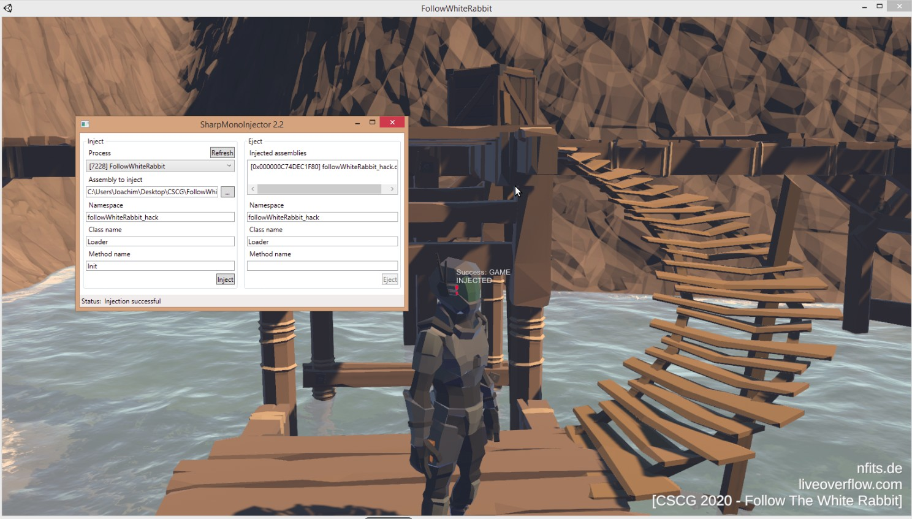
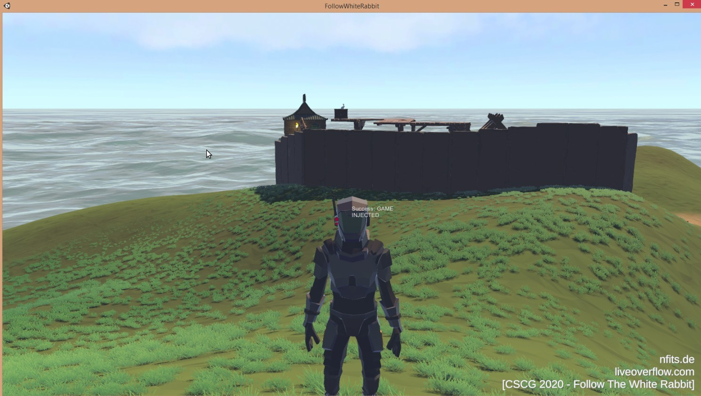

# Follow The White Rabbit

This was a unity game hacking challenge made by liveoverflow.

## Follow The White Rabbit - Cave

**Challenge**

Follow the white rabbit... into the hole.

**Solution**

The Challenge give us a complete Unity game.

As the description tells us, we have to follow the white rabbit into a hole.
When the game starts and we follow the white rabbit, we reach a hole and the rabbit jumps in. 
Unfortunatelly we are not invincible and we fall to death.

Image

So we have multiple solutions here. We can try to hack the game and teleport into the hole, so we don't have even to fall down. Or we can make us invincible.
**CheatEngine** can be helpful here, because it makes memory modification very easy (There are several tutorials for cheat engine, i.e. a video series from liveoverflow about game hacking https://www.youtube.com/watch?v=Pst-4NwY2is&list=PLhixgUqwRTjzzBeFSHXrw9DnQtssdAwgG&index=22)

Our plan is to use cheat engine to find the memory address of the players coordinations. When we find the y-coordination of our playable character, we can modify this value to teleport down to the bottom of the hole. 
To find the y-coordination we have to use cheat eninge and search for unknown float values. Cheat engine can search for memory values by looking for increasing, decreasing, unchanged, etc values.
So if we move our character a hill up and down, search for increased and decreased float values, we can decrease the possible memory addresses of the y-coordination.

Image

If we have found the correct value, modify this value to teleport our character up and down. 
By changing the value to **-201**, while stating in front of the hole, the character will reach the bottom of the hole without dying.


Image

Now we can follow the rabbit until we reach the flag:

Image

**Flag: **


## Follow The White Rabbit - Datamining

**Challenge**

It looks like the prison is still under construction on the currently shipped game... But I heard somebody figured out, that early parts of the unreleased content accidentally leaked into this release! Can you find it and follow the white rabbit? Game Trailer (https://www.youtube.com/watch?v=IhLBamqn_5Q)

**Solution**

If we watch the trailer, we can see a building which can't be found in the normal game. The name of the challenge gives us the hint to look into the game data.
The Programm AssetsStudio, helps us to see which scenes are used by the game. We can load the Folder **FollowTheWhiteRabbit\_Data** to see the different scenes. 
We can see a scene **level5** which contains objects like ** **.

We can try to load this scene using the SceneLoader from Unity, to load a Scene while we are ingame. This can load the missing building within the scene **level5**, which maybe contain the flag.

To load the scene, the following dll can be used and injected with **CheatEngine**:

```
using System;
using System.Collections.Generic;
using System.Linq;
using System.Text;
using System.Threading.Tasks;
using UnityEngine;
using UnityEngine.SceneManagement;

namespace followWhiteRabbit_hack
{
    class Main : MonoBehaviour
    {
        private const string ScenePath = @"C:\Users\Joachim\Desktop\CSCG\FollowWhiteRabbit\FollowWhiteRabbit_Data";
        private SceneLoader _sceneLoader;
        private PlayerController _playerC;

        public void Start()
        {
            _sceneLoader = FindObjectOfType<SceneLoader>();
            _playerC = FindObjectOfType<PlayerController>();
        }
        public void Update()
        {
            if (Input.GetKeyDown(KeyCode.F6))
            {
                _playerC.gravity = 0;
            }
            if (Input.GetKeyDown(KeyCode.F7))
            {
                GUI.Label(new Rect(Screen.width / 2, Screen.height / 2, 150f, 50f), "F6 pressed");
            }
            if (Input.GetKeyDown(KeyCode.F9))
            {
                AsyncOperation asyncLoad = SceneManager.LoadSceneAsync("FlagLand_Update", LoadSceneMode.Additive);
                asyncLoad.allowSceneActivation = true;
            }
            if (Input.GetKeyDown(KeyCode.F8))
            {
                AsyncOperation asyncLoad = SceneManager.LoadSceneAsync("level5");
                asyncLoad.allowSceneActivation = true;
            }
            if (Input.GetKeyDown(KeyCode.F10))
            {
                Scene scene = SceneManager.GetSceneByPath(ScenePath);
                GUI.Label(new Rect(Screen.width / 2, Screen.height / 2, 150f, 50f), scene.name);
            }
            if (Input.GetKeyDown(KeyCode.End)) // Will just unload our DLL
            {
                Loader.Unload();
            }
            sleep(5);
        }
        public void OnGUI()
        {

            GUI.Label(new Rect(Screen.width / 2, Screen.height / 2, 150f, 50f), "Success: GAME INJECTED"); 
            // Here you can call IMGUI functions of Unity to build your UI for the hack :)
        }
    }
}

using System;
using System.Collections.Generic;
using System.Linq;
using System.Text;
using System.Threading.Tasks;
using UnityEngine;

namespace followWhiteRabbit_hack
{
    public class Loader
    {
        public static void Init()
        {
            _Load = new GameObject();
            _Load.AddComponent<Main>();
            GameObject.DontDestroyOnLoad(_Load);
        }
        public static void Unload()
        {
            _Unload();
        }
        private static void _Unload()
        {
            GameObject.Destroy(_Load);
        }
        private static GameObject _Load;
    }
}
```

To inject the dll use tools like SharpMonoInjector. 



After injecting the dll, the scene can be loaded by pressing **F9** (see dll injection code).




Now we have to find the y-coordination of our Character again, to teleport us up to the building. Use cheat eninge and search for unknown float values. Cheat engine can search for memory values by looking for increasing, decreasing, unchanged, etc values.
So if we move our character a hill up and down, search for increased and decreased float values, we can decrease the possible memory addresses of the y-coordination.

If we have found the correct value, modify this value to teleport our character up and down. 

The flag can now be found in the new building


**Flag: CSCG{03ASY\_teleport\_and\_datamining\_scenes}**


