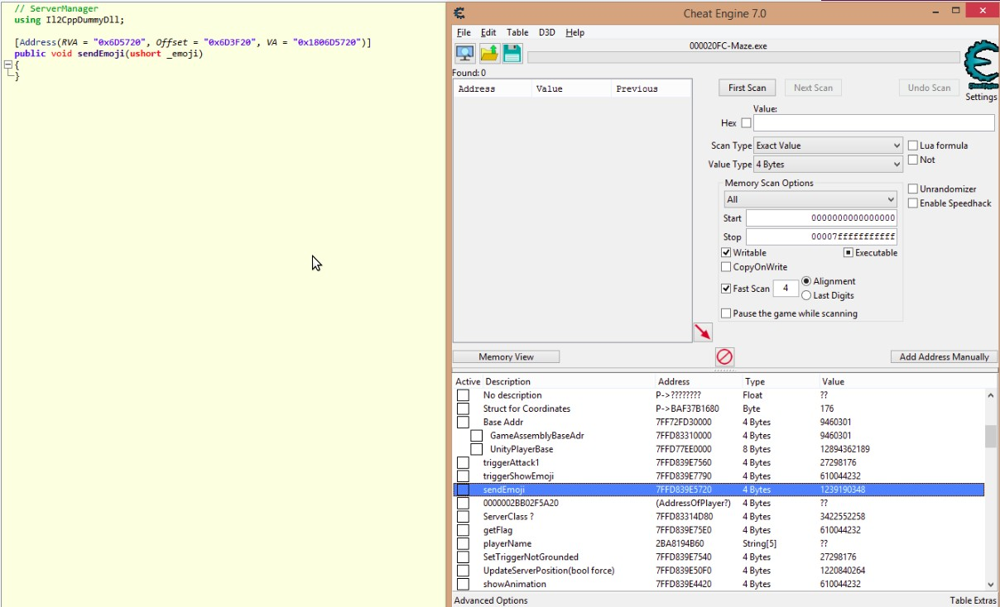
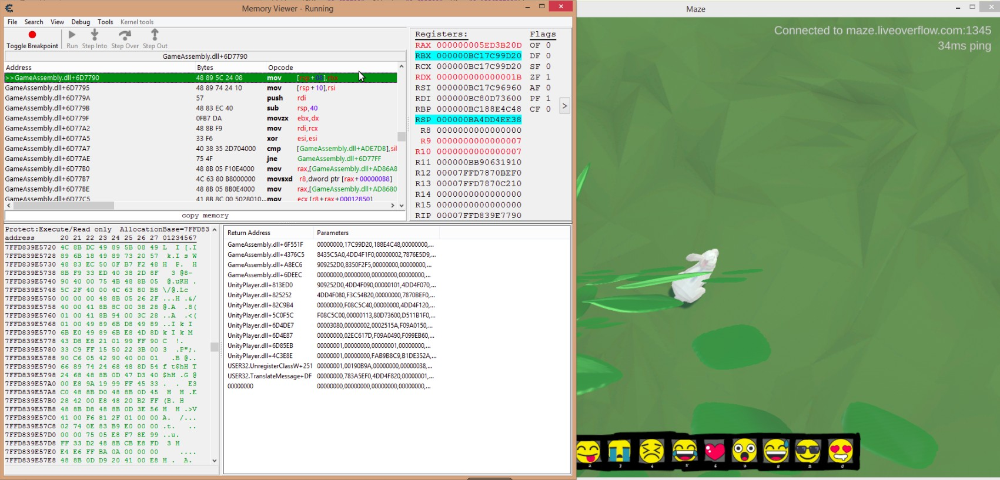
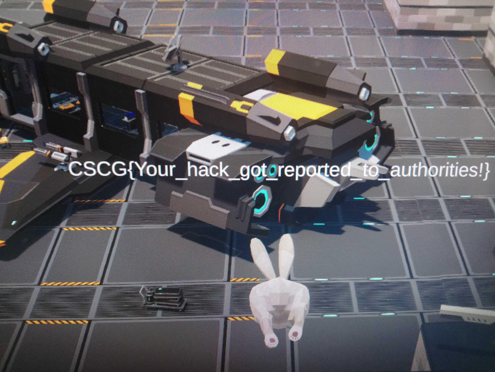
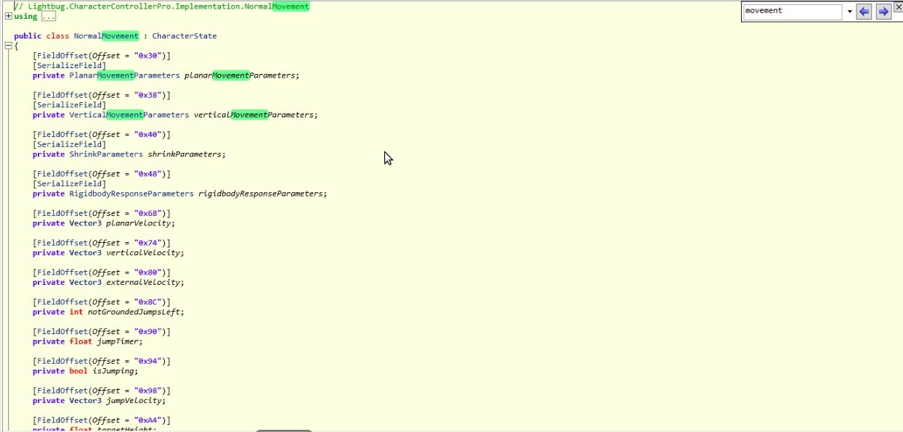
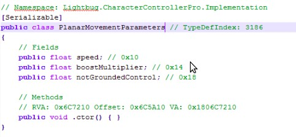
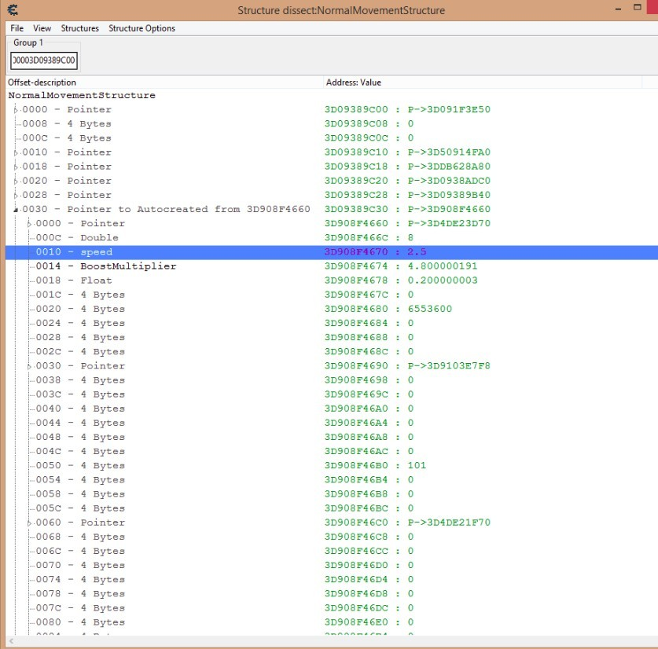
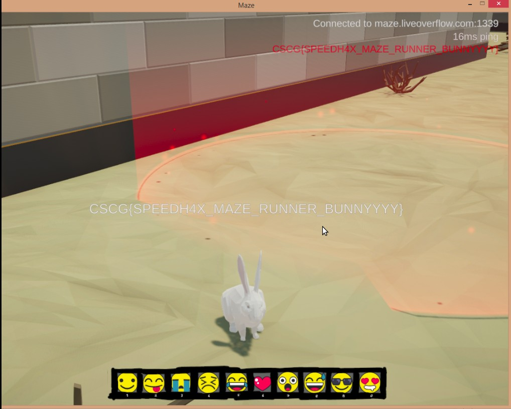
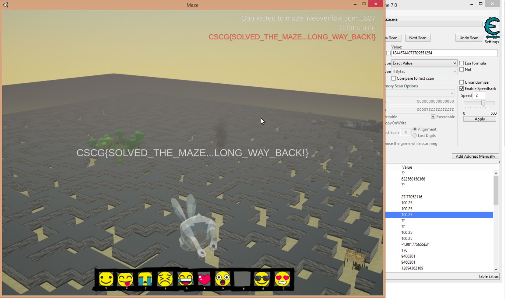
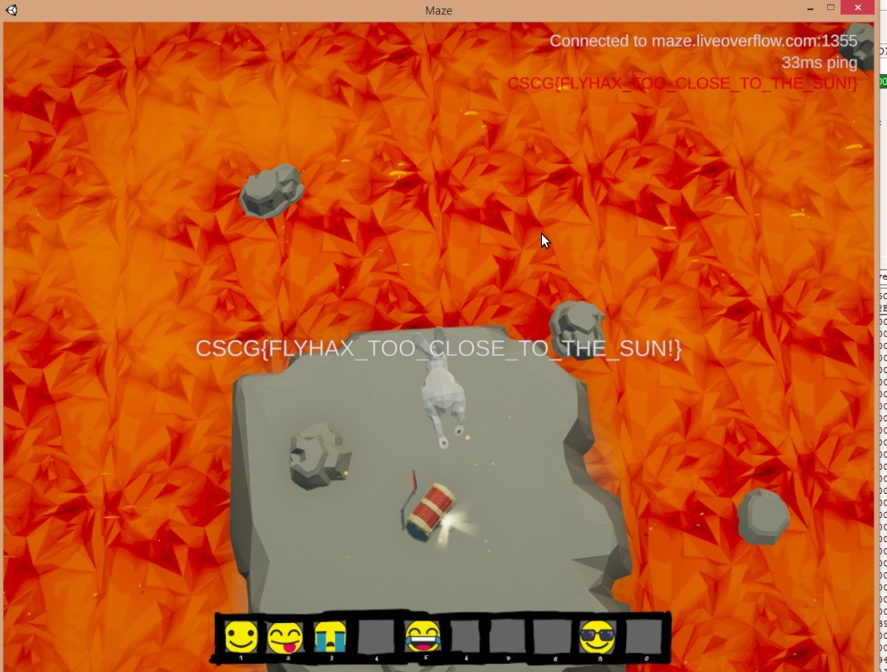

# Maze

## Emoji

**Challegen**

Only real hackers can use secret emojis.

See also: maze.liveoverflow.com

This is the second game challenge made by Liveoverflow.
This time we are a white rabbit in an online game and have to solve different challenges in a big maze.

**Solution**

The challenge description points out, that we have to take a look on the emoji function of the game. 
We can show multiple emojis to other players by pressing one of the number keys of our keyboard.
Unfortunately the game was created with IL2CPP(https://docs.unity3d.com/Manual/IL2CPP.html), which is like a security measure for unity games.
This makes reversing the game much harder.
Luckily there is a tool called il2CppDumper, which can restore the method header and the offsets from most of the fields and methods used by the game.

Now we can search for the method responsible for showing the emojis.

This seems to be the right method **"public void sendEmoji(ushort \_emoji)"**, which is at offset **"0x6D5720"**.
Now the plan is to use CheatEngine to set a breakpoint for this method, and change the parameter to another value.
To get the address for this method, we can use **"Add Address Manually"** and choose **"getAddress('GameAssembly.dll')+0x6D5720"** as address. 
Now we can open the debugger with a right click on this address and set a breakpoint. Now, if we try to show an emoji, the breakpoint will stop the execution.

The register RDX is the parameter **"\_emoji"**. When we change this value to 0xD, a flag emoji pops up and we get our flag:

**Flag: CSCG{Your\_hack\_got\_reported\_to\_authorities!}**

## Maze Runner

**Challenge**

Can you complete the scorch trials?

See also: maze.liveoverflow.com

This is the second game challenge made by Liveoverflow.
This time we are a white rabbit in an online game and have to solve different challenges in a big maze.

**Solution**

If you explore the maze near the spawn, you will reach a checkpoint, which starts a race.
This race is unbeatable with your current running speed. You have just a view seconds to reach the next checkpoint.
It seems that you have to get all the checkpoints before the time is running up.

Our plan here is to do a speed hack. There must be a value in the memory representing the speed of our rabbit (playable character).
We are also able to sprint in this game, thus there should be also a value representing the sprint speed, or a multiplier.

Unfortunately the game was created with IL2CPP(https://docs.unity3d.com/Manual/IL2CPP.html), which is like a security measure for unity games.
This makes reversing the game much harder.
Luckily there is a tool called il2CppDumper, which can restore the method header and the offsets from most of the fields and methods used by the game.

We can find a Class named **NormalMovement**, which has a field named **PlanarMovementParameters**.

The class **PlanarMovementParameters** has two interesting fields: **speed** and **boostMultiplier**.

Now the plan is to use CheatEngine to set a breakpoint at a method from **NormalMovement**, to get the address of the corresponding **NormalMovement** object (address is placed in the rcx register, when the method is called).
Then we can use CheatEngine to change the field in the **PlanarMovementParameters** object used by **NormalMovement**, which contains the **speed** field.

We can use the method **ProcessExternalMovement** which is triggered every second, to get the address of the **NormalMovement** object. To get the address for this method, we can use **Add Address Manually** and choose **getAddress('GameAssembly.dll')+0x6BDDC0** as address (The IL2CppDumper output contains the offset of methods and fields we use here).
Now we can open the debugger with a right click on this address and set a breakpoint. When the breakpoint is hit, we copy the Address from the RCX register.
This is the address of the **NormalMovement** object.
Then open the memory view of CheatEngine and open **Tools-\>Dissect Data/Struct** and paste the address.
(The offsets can be found in the IL2CppDumper output)

Now the speed value can be changed and the race is much easier:

**Flag: CSCG{SPEEDH4X\_MAZE\_RUNNER\_BUNNYYYY}**

## Tower

**Challenge**

Find a path to reach the tower and climb to the top.

See also: maze.liveoverflow.com

This is the second game challenge made by Liveoverflow.
This time we are a white rabbit in an online game and have to solve different challenges in a big maze.

**Solution**

The easiest Challegen was the **Tower** Challenge, where we just have to "solve" the maze and find a way to the big tower.

The first attempt was to use a flyhack to fly over the walls directly to the bit tower.
To do a simple fly hack, we have to find the characters y-coordination, which can be done by CheatEngine.
There are several tutorials, how to use **CheatEngine**. With this tool we can serach for values in the memory.
To find the y-coordination we have to use CheatEngine and search for unknown float values. CheatEngine can search for values or addresses in memory, by looking for increasing, decreasing and unchanged values.
So if we move our character a hill up and down, search for increased and decreased float values, we can decrease the number of possible memory addresses of the y-coordination.

When the y-coordination is found, we can lock the value and change it to a higher one to "fly".
unfortunately the server does not allow passing the walls, so we have to solve the maze manually. But with the fly hack, we have a good overview of the whole maze.

Just follow the paths until you reach the tower

(Image in the appendix)

**Flag: CSCG{SOLVED\_THE\_MAZE...LONG\_WAY\_BACK!}**

## The Floor is Lava

**Challenge**

Reach the chest surrounded by dangerous lava.

See also: maze.liveoverflow.com

This is the second game challenge made by Liveoverflow.
This time we are a white rabbit in an online game and have to solve different challenges in a big maze.

**Solution**

If you follow the paths of the maze, you find a big lava lake with a small island and a chest in the middle.
To reach this island we have to fly over the lake. 

To do a simple fly hack, we have to find the characters y-coordination, which can be done by CheatEngine.
There are several tutorials, how to use **CheatEngine**. With this tool we can serach for values in the memory.
To find the y-coordination we have to use CheatEngine and search for unknown float values. CheatEngine can search for values or addresses in memory,by looking for increasing, decreasing and unchanged values.
So if we move our character a hill up and down, search for increased and decreased float values, we can decrease the number of possible memory addresses of the y-coordination.

When the y-coordination is found, we can lock the value and change it to a higher one to "fly".
unfortunately the server does not allow passing the walls, so we have to solve the maze manually. But with the fly hack, we have a good overview of the whole maze.

(image in the appendix)

**Flag: CSCG{FLYHAX\_TOO\_CLOSE\_TO\_THE\_SUN!}**

