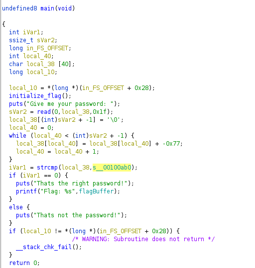

# Reverse Engineering Challenges

## Intro to Reversing 1 

**Challenge**

This is the first reversing Challenge with the difficulty baby. We obtain the Flag from the server if we pass the right password. We also have the binary, running on the server.

**Solution**

As always try strings at first, which shows us the password immidiately in this challenge.
So the response from **"strings ./rev1"** contains the following output:
> Give me your password: 
y0u_5h3ll_p455    
Thats the right password!

Now if we running the binary and passing the password **"y0u_5h3ll_p455"**, we get the flag:
**CSCG{ez_pz_reversing_squ33zy}**

To avoid this security issue, the password could be placed on the server side (for example placed within a file) or the password comparison, within the binary, could use only the hashed password.


## Intro to Reversing 2

**Challenge**

This is the second reversing Challenge with the difficulty baby. We obtain the Flag from the server if we pass the right password. We also have the binary, running on the server.

**Solution**

This time **"strings ./rev2"** does not work for this challenge.
My second try was using **"ltrace ./rev2"** to see if the binary calling some string comparison functions. 


Seems to be a unknown encoding, so lets look into the binary with Ghidra.



The main function contains the strcmp we saw in the ltrace output.
so our input is the variable **local_38** and **s__00100ab0** is the password we are looking for.
The memory contains a bunch of bytes which could be our password we are looking for: 
> FC,FD,EA,C0,BA,EC,E8,FD,FB,BD,F7,BE,EF,B9,FB,F6,BD,C0,BA,B9,F7,E8,F2,FD,E8,F2,FC

Not all bytes are in ascii range, so lets look a bit closer to the rest of this code.

the while loop above the strcmp adds the value -0x77 to each value of our input.
Hence, the password here is transformed with this byte substraction.

Just lets write a short python code to revert this transformation:

```
password = [0xFC,0xFD,0xEA,0xC0,0xBA,0xEC,0xE8,0xFD,0xFB,0xBD,0xF7,0xBE,0xEF,0xB9,0xFB,0xF6,0xBD,0xC0,0xBA,0xB9,0xF7,0xE8,0xF2,0xFD,0xE8,0xF2,0xFC]
result = ""
for p in password:
    p = (p+0x77)%256
    result += chr(p)
print(result)
```


Executing this script will give us the password we are looking for:
**sta71c_tr4n5f0rm4710n_it_is**

Now the last step is again passing the password to the binary on the server, using netcat and receiving the flag.
**CSCG{1s_th4t_wh4t_they_c4ll_on3way_transf0rmati0n?}**

Again, this security issue can be avoided, if the password string isn't in the binary. The password can be placed encrypted on the server.


## Intro to Reversing 3

**Challenge**

Like the two challanges before (Intro to  Reversing 1/2) we have to get a password to receive the flag from the server.

**Solution**

As alwys lets try if we get information about the programm using **strings** and **ltrace**.
**ltrace** shows us that we have a string comparison again, but it looks like the password is encrypted this time.

> lp`7a<qLw\x1ekHopt(f-f*,o}V\x0f\x15J

We can checkt this by opening ghidra or another reverse engeneering tool and look at the decompiled code for the main method.
The main method contains again a transformation. This time the program take each char and calculating:
> (inputChar ^ (CharIndex - 10)) - 2

We can calculate the password by coping the string from the **ltrace** string comparison 

> lp`7a<qLw\x1ekHopt(f-f*,o}V\x0f\x15J

and revert the transformation with the following python script:

```
import os

password_encrypted = "lp`7a<qLw\x1ekHopt(f-f*,o}V\x0f\x15J"
password_decrypted = ""
for i in range(0, len(password_encrypted)):
    currentChar = ord(password_encrypted[i])
    currentChar += 2
    currentChar ^= (i+10)
    password_decrypted += chr(currentChar)
print(password_decrypted)
os.system("echo \"{}\" | nc hax1.allesctf.net 9602".format(password_decrypted))
```

Running this script results in the following output:

> dyn4m1c_k3y_gen3r4t10n_y34h
Give me your password: 
Thats the right password!
Flag: CSCG{pass_1_g3ts_a_x0r_p4ss_2_g3ts_a_x0r_EVERYBODY_GETS_A_X0R}


Again, this security issue can be avoided, if the password string isn't in the binary. The password can be placed encrypted on the server.


