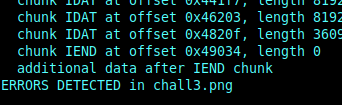

# Steganography

## Intro to Steganography 1

**Challenge**

"This is an introductory challenge for the almighty steganography challenges. The three stages contain very different variants of hidden information. Find them!"

For this challenge we only have an image "chall.jpg".

**Solution**

Because this is a stego challenge and we see nothing interesting on the image, lets see if we find any data within the file.
If we use **"exiftool chall.jpg"** or **"file chall.jpg"**, we find a comment **"alm1ghty\_st3g4n0\_pls\_g1v\_fl4g"**, which looks like a password. This can be usefull later.

One of the standard tools for stegonography challenges is **"stegohide"**, which can extract hidden data within the file.
So we can try **"stegohide extract -sf chall.jpg"**, to extract some hidden data. To do this, stegohide asks for a password. If we use the password from the comment, we found before, stegohide extracts a file **"flag.txt"**.
This file contains the hidden flag **CSCG{Sup3r\_s3cr3t\_d4t4}**

## Intro to Steganography 2

**Challenge**

"This is an introductory challenge for the almighty steganography challenges. The three stages contain very different variants of hidden information. Find them!"

Again, we only get an image "chall.jpg".

**Solution**

The image shows some highrise buildings in the night.

**Challenge image**

Luckily i already saw this kind of challenge and knew instantly what to do.
So if we search for the original image with google, we see that there are some differences.
The highest tower on the left looks different. The lights in the windows are different from the original.

**Binary code within the image**

The windows in the upper left corner form a binary code
```
010000110101001101000011010001110111101101100001010111110100011001101100001101000110011101111101
```

Converting this binary code to ascii, retuls in the flag: **CSCG{a\_Fl4g}**


## Intro to Steganography 3

**Challenge**

"This is an introductory challenge for the almighty steganography challenges. The three stages contain very different variants of hidden information. Find them!"

To solve this challenge we only get an image file "chall.png".


**Challenge image chall.png**

**Solution**

Exiftool and steghide doesn't work this time. 
I used pngcheck ("pngcheck -v chall.png") to get some information about this file and it tells me that there is some data after the IEND chunk.


**data after IEND**

A png file consists of different chunk. The last chunk of a png file is the IEND chunk, which signals the end of the png file. So we maybe have some interesting at the end of this file.
So i opened the file with vim and switched to xdd with “:%!xxd” to view the hexdump of the file, and searched for the IEND chunk.
And yes there were some data behind the IEND chunk and also an interesting string “flag.txt”. Thus we have to extract this txt file to get the flag.
We can use **pngsplit** to get the different chunks and also the chunk behind IEND. It seems to be a zip file which needs a password. **Binwalk** can also extract the file.
The last step here is to find the password and extract the flag or bypass this password. 
When i try to unzip the file i get the following error: "need PK compat. v5.1" 
After some google research i got the tipp to use "7z", but this also needs a password.

Because i connot find anything in the metadata or in the strings of the file, lets look at the picture itself.
So i downloaded stegsolve.jar, a java application which can modify our image in different ways. I startet it with **java -jar stegsolve.jar** and opened chall.png.
While i scrolled through some different versions of the file i detected a message in the background of the image. The “random colour map”-Version of our image shows the password: **s33\_m3\_1f\_y0u\_c4n**.


**hidden password**

Now the last obvious step is extracting the flag.txt with the found password and receiving the flag: **CSCG{H1dden_1n\_pla1n\_s1ght}**
