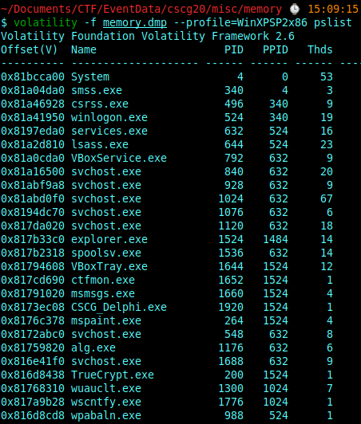
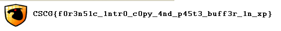
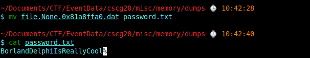
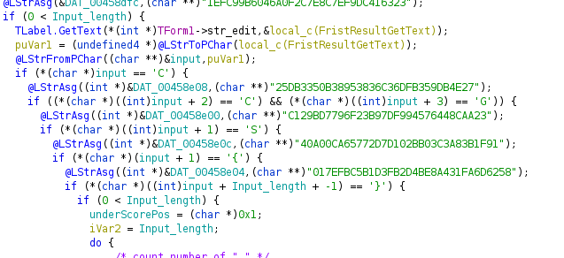
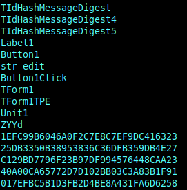
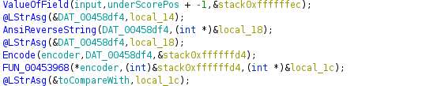

# MISC

## win_eXPerience 1 & win_eXPerience 2

**Challenge**

win_eXPerience 1:

R3m3mb3r th3 g00d 0ld 1337 d4y5, wh3r3 3ncrypt10n t00l5 4r3 u53d, wh1ch 4r3 d34d t0d4y 4nd r3c0mm3nd b1tl0ck3r. H4v3 fun t0 f1nd th15 5m4ll g3m 1n th3 m3m0ry dump.

win_eXPerience 2:

R3m3mb3r th3 g00d 0ld 1337 d4y5, wh3r3 cr4ckm35 4r3 wr1tt3n 1n l4ngu4g35, wh1ch 4r3 d34d t0d4y. H4v3 fun t0 f1nd th15 5m4ll g3m 1n th3 m3m0ry dump.

**Solution**

The challenge gave us a memory dump, which can be analyzed with volatility.

The first step, as always, is to examine the profile for volatility.
So run volatility with opion **"-f memdump.dmp imageinfo"** to get this information. 
Now we know that we need to use the profile **"WinXPSP2x86"**.

The next step is to examine the memroy dump. We can use multiple plugins from volatility to examine the memory.
For example **pslist/pstree** to see the processes were running, when the memory dump was created.



The challenge description talks about an encryption. So we can look closer on the processes CSCG_Delphi.exe and TrueCrypt.exe.
But also the mspaint.exe could be interesting.
We can dump these processes and look into them 
```
volatility -f memory.dmp --profile=WinXPSP2x86 procdump -p [PID])
```
We can also dump the memory and analize these.

**First Flag (fake flag)**:

After dumping the processes and the corresponding memory, we can start with a simple strings command on the memory.
Using 

```
strings 1920.dmp | grep CSCG
```

on the memory dump of the process **CSCG_Delphi.exe**, we can see that there is a file **"flag.PNG"**. If we can extract this file, we may receive a flag.
So i used 

```
volatilty -f memory.dmp --profile=WinXPSP2x86 filescan | grep PNG
```

to receive the physical offset of the file handle. 
This allows us to extract the PNG with 

```
volatilty -f memory.dmp --profile=WinXPSP2x86 dumpfiles -Q 0x00000000017c90e8 --dump-dir=./
```



The image contains a flags: **CSCG{fOr3n51c\_1ntrO\_cOpy\_4nd\_p45t3\_buff3r\_1n\_xp}**
Unfortunatelly the Flag was wrong and the organizers later published that this is a flag which was intended for an older version of this challenge. 

**Second Flag:**

I investigated further with different commands

```
**View the desktop:**
volatilty -f memory.dmp --profile=WinXPSP2x86 screenshot --dump-dir=./

**view the commandline**:
volatility -f memory.dmp --profile=WinXPSP2x86 cmdline

**show the users:**:
volatility -f memory.dmp --profile=WinXPSP2x86 printkey -K "SAM\Domains\Account\Users\Names"

**and showing the network communications with:**
volatility -f memory.dmp --profile=WinXPSP2x86 connscan
volatility -f memory.dmp --profile=WinXPSP2x86 sockets
```

We can also load the memory dumps of the three processes in gimp, to see if i can found something on the screen. But there was only an open mspaint process which could have been used to create the fake flag.

The file **TrueCrypt.exe** is also interesting. Maybe we have somewhere an encrypted file which contains the flag.
So again we can use filescan to look at the file handles in the memory dump.
There was a file named **"\Device\TrueCryptVolumeE\flag.zip"**.
This seems to be the right file, but we need a password to extract the contained flag.
With 

```
"volatility -f memory.dmp --profile=WinXPSP2x86 truecryptsummary"
```
some usefull information can be shown:
```
Volatility Foundation Volatility Framework 2.6
Process              TrueCrypt.exe at 0x816d8438 pid 200
Service              truecrypt state SERVICE_RUNNING
Kernel Module        truecrypt.sys at 0xf7036000 - 0xf706d000
Symbolic Link        E: -> \Device\TrueCryptVolumeE mounted 2020-03-22 18:30:32 UTC+0000
Symbolic Link        Volume{93193a72-6c5c-11ea-a09c-080027daee79} -> \Device\TrueCryptVolumeE mounted 2020-03-22 18:28:42 UTC+0000
Symbolic Link        E: -> \Device\TrueCryptVolumeE mounted 2020-03-22 18:30:32 UTC+0000
File Object          \Device\TrueCryptVolumeE\$LogFile at 0x16d9c48
File Object          \Device\TrueCryptVolumeE\$BitMap at 0x1706100
File Object          \Device\TrueCryptVolumeE\password.txt at 0x1717be8
File Object          \Device\TrueCryptVolumeE\$Directory at 0x1718190
File Object          \Device\TrueCryptVolumeE\$Mft at 0x1797e80
File Object          \Device\TrueCryptVolumeE\$MftMirr at 0x185cb80
File Object          \Device\TrueCryptVolumeE\flag.zip at 0x1a3c7e8
File Object          \Device\TrueCryptVolumeE\$Mft at 0x1a85940
File Object          \Device\TrueCryptVolumeE\$Directory at 0x1ae55a0
Driver               \Driver\truecrypt at 0x19d0b10 range 0xf7036000 - 0xf706cb80
Device               TrueCryptVolumeE at 0x8172fa48 type FILE_DEVICE_DISK
Container            Path: \??\C:\Program Files\TrueCrypt\true.dmp
Device               TrueCrypt at 0x816d4be0 type FILE_DEVICE_UNKNOWN
```

The output contains a file named **"\Device\TrueCryptVolumeE\password.txt"**. 
Again we dump the file and extract its content. 

```
volatility -f memory.dmp --profile=WinXPSP2x86 filescan | grep .txt
```



Now we have the password to extract the flag:
**CSCG{c4ch3d\_p455w0rd\_fr0m\_0p3n\_tru3\_cryp1\_c0nt41n3r5}**

**Third Flag:**

So because the first flag we found was just a fake flag, we have to start investigating again. 
The challenge description of the missing flag and the clipboard of the memory dump give us a hint where we should look at:
**"R3m3mb3r th3 g00d 0ld 1337 d4y5, wh3r3 cr4ckm35 4r3 wr1tt3n 1n l4ngu4g35, wh1ch 4r3 d34d t0d4y. H4v3 fun t0 f1nd th15 5m4ll g3m 1n th3 m3m0ry dump."**

So the process **CSCG_Delphi.exe** seems to be a kind of crackme challenge and the password is the flag.
So i started ghidra and start reversing. I also downloaded the Program "IDR" and "DeDe" which can give me some missing symbols of the binary and could help with the decompilation.
The intersting function is the **Button1Click** function which obviously contains our flag.



When using **"strings CSCG_Delphi.exe"** there are strings nearby a function called "TIdHashMessageDigests". 



Coping the strings into a hash cracker (https://hashes.com/en/decrypt/hash) results in these strings:

```
1efc99b6046a0f2c7e8c7ef9dc416323:dl0
25db3350b38953836c36dfb359db4e27:kc4rc
40a00ca65772d7d102bb03c3a83b1f91:!3m
c129bd7796f23b97df994576448caa23:l00hcs
017efbc5b1d3fb2d4be8a431fa6d6258:1hp13d
```

Also the Button1Click function seems to counter the number of underscore symbols and also uses a string reversing function. 



Now the solution is pretty clear. If we reverse the strings from the cracked hashes and concatinating them, we get the flag:
**Flag: CSCG{0ld_sch00l_d31ph1_cr4ck_m3!}**
