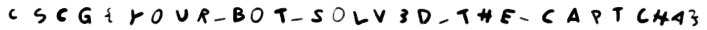

# MISC

## Captcha

**Challenge**

"The Enrichment Center regrets to inform you that this next test is impossible. Make no attempt to solve it. No one will blame you for giving up. In fact, quitting at this point is a perfectly reasonable response."

http://hax1.allesctf.net:9200/

**Solution**

The challenge description leads us to a website asking for a single Captcha, which has to be solved within 30 seconds.
If we solve the first captcha we are redirected to a "second level" and we have to solve even more captchas within 30 seconds. 
We can see that there are 4 Levels and every level will become harder and impossible to solve by hand within 30 seconds.
So we have to write a bot solving these captchas. Unfortunatelly the captchas are images with crisscross letters, thus we cant just get the string from the website.

So my first attempt was a simple pytesseract script. Pytesseract is a wrapper for tersseract which is an optical character recognition engine.
This script should just download the captcha images, converts the text on the image into a string and sends a post request with the soluion.
Because i have already done a challange like that and it was very painful with tesseract, I decided that i won't commit 100 % on this approach. 
Pytesseract can be very slow and inaccuate without a lot of image preprocessing and optimization.

As mentioned, to increase the accuraccy of tesseract, we have to do some image preprocessing. 
Lets download one of the capcha images and saved it for some tests. 
Now we can convert the image to monochrome picture, resizing it and use a detail and sharpening filter.

```
import cv2
import imutils
import sys
import time
import numpy as np
import requests
from pytesseract import image_to_string 
from PIL import Image, ImageFilter, ImageEnhance
from io import BytesIO


def solveSingleCaptcha(im):
    im = im.convert('L')
    #im = im.resize(((5 * im.width), (5 * im.height)), Image.ANTIALIAS)
    im = im.filter(ImageFilter.DETAIL)
    im = im.filter(ImageFilter.SHARPEN)
    #im.save('temp2.png')
    text = image_to_string(im, config="-c tessedit_char_whitelist=abcdefghijklmnopqrstuvwxyzABCDEFGHIJKLMNOPQRSTUVWXYZ1234567890 --oem 0 --psm 8").replace(' ', '')
    print(text)
```

But if we call the pytesseract function **"image_to_text"** with our image and some tesseract configs to receive the string, the results were completely wrong.
As i expceted the font and the angle of the letters seems to be a real problem for the tool. 

I rememerd that there is a blog post about a machine learning approach for solving those kind of captchas.
I found it at **https://medium.com/@ageitgey/how-to-break-a-captcha-system-in-15-minutes-with-machine-learning-dbebb035a710**
This approach extract each letter from a labeled captcha file to train a neuronal network.

To use this approach we need labeled trainings data, but luckily the challenge give us the right answer for a captcha, if we fail. Thus we can create a labeled set of trainings data.
This seems to be a great solution for this problem and maybe we can learn something new.
The code for the learning algorithm (**extract\_single\_letters\_from\_captchas.py**, **solve_captchas_with_model.py**, **train_model.py**) can be downloaded from the page so we only have to get some training data to train our own neuronal network.
I wrote a wrapper in python which call different functions, like downloading the trainingsdata set or start the captcha calulation with the code we can get from the website ( **https://medium.com/@ageitgey/how-to-break-a-captcha-system-in-15-minutes-with-machine-learning-dbebb035a710** ).

```
from lxml import html
from bs4 import BeautifulSoup
import json
import requests
import re
import os
import base64
import solve_captchas_with_model

HOST = "http://hax1.allesctf.net:9200"
URL0 = HOST+"/captcha/0"
URL1 = HOST+"/captcha/1"
URL2 = HOST+"/captcha/2"
URL3 = HOST+"/captcha/3"
TO_SOLVE_DIR = "/home/user/Documents/CTF/EventData/cscg20/misc/captcha/MLApproach/solving_captchas_code_examples/ToSolve"
RESULTS_DIR = "/home/user/Documents/CTF/EventData/cscg20/misc/captcha/MLApproach/solving_captchas_code_examples/Results"
s = requests.Session()

def extractEncodedImageFromHTML(page):
    #for span_text in page.xpath("//img[@class='rtq_exch']/text()"):
    matches = re.findall(r'\ssrc="([^"]+)"', page)
    result = []
    for m in matches:
        m = result.append(m[22:])
    return result  

def extractLabel(url):
    page = s.get("http://hax1.allesctf.net:9200/captcha/1").text
    #get the correct captcha content
    t = BeautifulSoup(page,'lxml')
    return t.b.text

def getTrainingsdata(trainingsDataSize):
    for i in range(0,trainingsDataSize):
        url = "http://hax1.allesctf.net:9200/captcha/0"
        page = s.get(url).text
        image = extractEncodedImageFromHTML(page)[0]
        fileName = extractLabel("http://hax1.allesctf.net:9200/captcha/1")
        #for i in images:
        fh = open("Images/{}.png".format(fileName), "wb")
        fh.write(base64.b64decode(image))
        fh.close()

def solveFirstLevelCaptcha():
    url = "http://hax1.allesctf.net:9200/captcha/0"
    page = s.get(url).text
    image = extractEncodedImageFromHTML(page)[0]
    fh = open(TO_SOLVE_DIR+"/{}.png".format("image"), "wb")
    fh.write(base64.b64decode(image))
    fh.close()

    #solve with neuronal network
    solve_captchas_with_model.test()

    f = open(RESULTS_DIR+"/result.txt","r")
    captcha = f.readline()

    #make post request with the result
    param = {'0':captcha.strip("\n")}
    response = s.post(URL0, data=param)

    #remove to solve files and results
    removeFilesFromDirectory(TO_SOLVE_DIR)
    return response

def captchaPostRequest(url, captcha):
    pass

def solveNextLevelCaptcha(level,response):
    URL = "http://hax1.allesctf.net:9200/captcha/{}.html".format(level)
    images = extractEncodedImageFromHTML(response)
    name_counter = 0
    for i in images:
        fh = open(TO_SOLVE_DIR+"/{}.png".format(name_counter), "wb")
        fh.write(base64.b64decode(i))
        fh.close()
        name_counter += 1
    # now solve with the neuronal network
    #os.system("python solve_captchas_with_model.py")
    solve_captchas_with_model.test()
    f = open(RESULTS_DIR+"/result.txt","r")
    dictionary = {}
    i = 0
    for l in f:
        dictionary.update( {i : l.strip("\n")})
        i+=1
    #make post request with the results
    #param = json.dumps(dictionary)
    param = dictionary
    #print(param)
    response = s.post(URL, data=param)
    #print(response.text)

    # remove all files from the ToSolve directory
    removeFilesFromDirectory(RESULTS_DIR) 
    return response

def removeFilesFromDirectory(folder):
    for filename in os.listdir(folder):
        file_path = os.path.join(folder, filename)
        try:
            if os.path.isfile(file_path) or os.path.islink(file_path):
                os.unlink(file_path)
        except Exception as e:
            print('Failed to delete %s. Reason: %s' % (file_path, e))

if __name__=='__main__':
    #uncomment if you need some training captchas
    #getTrainingsdata(1000)
    correct = False
    response = None
    while not correct:
        removeFilesFromDirectory(TO_SOLVE_DIR) 
        response = solveFirstLevelCaptcha()
        if "Human detected" in response.text:
            continue
        print("[::::::] FIRST LEVEL CORRECT ![::::::] ")
        response = solveNextLevelCaptcha(1, response.text)
        if "Human detected" in response.text:
            continue
        print("[::::::] SECOND LEVEL CORRECT ![::::::] ")
        response = solveNextLevelCaptcha(2, response.text)
        if "Human detected" in response.text:
            continue
        print("[::::::] THIRD LEVEL CORRECT ![::::::] ")
        response = solveNextLevelCaptcha(3, response.text)
        if "Human detected" in response.text:
            continue
        print("[::::::] FOURTH CORRECT ![::::::] ")
        #print(response.text)
        flag = open('flag.txt', 'w')
        flag.write(response.text)
        break

    s.close() 
```

Our set of trainingsdata are captchas with the correct captcha solution as file name. If we have enough sample captchas, we can use the **extract\_single\_letters\_from\_captchas.py** to extract each letter from the capchas and save this image in a single image. This image is also labled with the correct name. Then we can train the neuronal network with **train_model.py**.
Now we can use our writte script to get the captchas we have to solve and call **solve_captchas_with_model.py** to get the correct answer.

We also have to edit the **extract\_single\_lettser\_from\_captchas.py** and **solve_captchas_with_model.py**, because the solver had some problems with some letters. The letter extraction script calculates a contour for each letter in the captch.
The content within the contour is then saved in a new labled file.
If this contour contains multiple letters or we have to much contours (i.e the small letter "i" caused to many contours), our trainingsdata can contain wrong labled data.
To work around this problem i changed the preprocessing of the image and the contour calculation in **extract\_single\_lettser\_from\_captchas.py** and **solve_captchas_with_model.py**.
(This is just a snipped of the code)

```
.
.
.

# Load the image and convert it to grayscale
    kernel = np.ones((2,2),np.uint8)
    kernel2 = np.ones((2,2),np.uint8)
    image = cv2.imread(captcha_image_file)
    gray = cv2.cvtColor(image, cv2.COLOR_BGR2GRAY)
    gray = cv2.resize(gray, None, fx=5, fy=5, interpolation=cv2.INTER_LINEAR)
    gray = cv2.dilate(gray,kernel2,iterations = 1)
    gray = cv2.erode(gray,kernel,iterations = 1)

.
.
.

for contour in contours:
        # Get the rectangle that contains the contour
        (x, y, w, h) = cv2.boundingRect(contour)

        print("contour nr: ", c)
        print("width : ", w)
        print("height : ", h)
        if (w / h > 1.30 and (w > 95)) or w > 95:
            #print("to large")
            # This contour is too wide to be a single letter!
            # Split it in half into two letter regions!
            half_width = int(w / 2)
            letter_image_regions.append((x, y, half_width, h))
            letter_image_regions.append((x + half_width, y, half_width, h))
        elif w < 25 and h < 25:
            print("small i dot ignored")

        else:
            # This is a normal letter by itself
            letter_image_regions.append((x, y, w, h))
        c+=1

# If we found more or less than 4 letters in the captcha, our letter extraction
    # didn't work correcly. Skip the image instead of saving bad training data!
    file_name = os.path.splitext(os.path.basename(captcha_image_file))[0]
    if len(letter_image_regions) != len(file_name):
        countFails +=1
        print("wrong length")
        cv2.rectangle(gray, (x - 2, y - 2), (x + w + 4, y + h + 4), (0, 255, 0), 1)
        continue

.
.
.

```

Now the wrapper can be used to calculate the captchas of the challenge. This can take some time, dependent of the accuracy of the neuronal network.
When all captchas are solved, we receive an image with the flag:




## win_eXPerience 1 & win_eXPerience 2

**Challenge**

win_eXPerience 1:

R3m3mb3r th3 g00d 0ld 1337 d4y5, wh3r3 3ncrypt10n t00l5 4r3 u53d, wh1ch 4r3 d34d t0d4y 4nd r3c0mm3nd b1tl0ck3r. H4v3 fun t0 f1nd th15 5m4ll g3m 1n th3 m3m0ry dump.

win_eXPerience 2:

R3m3mb3r th3 g00d 0ld 1337 d4y5, wh3r3 cr4ckm35 4r3 wr1tt3n 1n l4ngu4g35, wh1ch 4r3 d34d t0d4y. H4v3 fun t0 f1nd th15 5m4ll g3m 1n th3 m3m0ry dump.

**Solution**

The challenge gave us a memory dump, which can be analyzed with volatility.

The first step, as always, is to examine the profile for volatility.
So run volatility with opion **"-f memdump.dmp imageinfo"** to get this information. 
Now we know that we need to use the profile **"WinXPSP2x86"**.

The next step is to examine the memroy dump. We can use multiple plugins from volatility to examine the memory.
For example **pslist/pstree** to see the processes were running, when the memory dump was created.


The challenge description talks about an encryption. So we can look closer on the processes CSCG_Delphi.exe and TrueCrypt.exe.
But also the mspaint.exe could be interesting.
We can dump these processes and look into them 
```
volatility -f memory.dmp --profile=WinXPSP2x86 procdump -p [PID])
```
We can also dump the memory and analize these.

**First Flag (fake flag)**:

After dumping the processes and the corresponding memory, we can start with a simple strings command on the memory.
Using 

```
strings 1920.dmp | grep CSCG
```

on the memory dump of the process **CSCG_Delphi.exe**, we can see that there is a file **"flag.PNG"**. If we can extract this file, we may receive a flag.
So i used 

```
volatilty -f memory.dmp --profile=WinXPSP2x86 filescan | grep PNG
```

to receive the physical offset of the file handle. 
This allows us to extract the PNG with 

```
volatilty -f memory.dmp --profile=WinXPSP2x86 dumpfiles -Q 0x00000000017c90e8 --dump-dir=./
```


The image contains a flags: **CSCG{fOr3n51c\_1ntrO\_cOpy\_4nd\_p45t3\_buff3r\_1n\_xp}**
Unfortunatelly the Flag was wrong and the organizers later published that this is a flag which was intended for an older version of this challenge. 

**Second Flag:**

I investigated further with different commands

```
**View the desktop:**
volatilty -f memory.dmp --profile=WinXPSP2x86 screenshot --dump-dir=./

**view the commandline**:
volatility -f memory.dmp --profile=WinXPSP2x86 cmdline

**show the users:**:
volatility -f memory.dmp --profile=WinXPSP2x86 printkey -K "SAM\Domains\Account\Users\Names"

**and showing the network communications with:**
volatility -f memory.dmp --profile=WinXPSP2x86 connscan
volatility -f memory.dmp --profile=WinXPSP2x86 sockets
```

We can also load the memory dumps of the three processes in gimp, to see if i can found something on the screen. But there was only an open mspaint process which could have been used to create the fake flag.

The file **TrueCrypt.exe** is also interesting. Maybe we have somewhere an encrypted file which contains the flag.
So again we can use filescan to look at the file handles in the memory dump.
There was a file named **"\Device\TrueCryptVolumeE\flag.zip"**.
This seems to be the right file, but we need a password to extract the contained flag.
With 

```
"volatility -f memory.dmp --profile=WinXPSP2x86 truecryptsummary"
```
some usefull information can be shown:
```
Volatility Foundation Volatility Framework 2.6
Process              TrueCrypt.exe at 0x816d8438 pid 200
Service              truecrypt state SERVICE_RUNNING
Kernel Module        truecrypt.sys at 0xf7036000 - 0xf706d000
Symbolic Link        E: -> \Device\TrueCryptVolumeE mounted 2020-03-22 18:30:32 UTC+0000
Symbolic Link        Volume{93193a72-6c5c-11ea-a09c-080027daee79} -> \Device\TrueCryptVolumeE mounted 2020-03-22 18:28:42 UTC+0000
Symbolic Link        E: -> \Device\TrueCryptVolumeE mounted 2020-03-22 18:30:32 UTC+0000
File Object          \Device\TrueCryptVolumeE\$LogFile at 0x16d9c48
File Object          \Device\TrueCryptVolumeE\$BitMap at 0x1706100
File Object          \Device\TrueCryptVolumeE\password.txt at 0x1717be8
File Object          \Device\TrueCryptVolumeE\$Directory at 0x1718190
File Object          \Device\TrueCryptVolumeE\$Mft at 0x1797e80
File Object          \Device\TrueCryptVolumeE\$MftMirr at 0x185cb80
File Object          \Device\TrueCryptVolumeE\flag.zip at 0x1a3c7e8
File Object          \Device\TrueCryptVolumeE\$Mft at 0x1a85940
File Object          \Device\TrueCryptVolumeE\$Directory at 0x1ae55a0
Driver               \Driver\truecrypt at 0x19d0b10 range 0xf7036000 - 0xf706cb80
Device               TrueCryptVolumeE at 0x8172fa48 type FILE_DEVICE_DISK
Container            Path: \??\C:\Program Files\TrueCrypt\true.dmp
Device               TrueCrypt at 0x816d4be0 type FILE_DEVICE_UNKNOWN
```

The output contains a file named **"\Device\TrueCryptVolumeE\password.txt"**. 
Again we dump the file and extract its content. 

```
volatility -f memory.dmp --profile=WinXPSP2x86 filescan | grep .txt
```


Now we have the password to extract the flag:
**CSCG{c4ch3d\_p455w0rd\_fr0m\_0p3n\_tru3\_cryp1\_c0nt41n3r5}**

**Third Flag:**

So because the first flag we found was just a fake flag, we have to start investigating again. 
The challenge description of the missing flag and the clipboard of the memory dump give us a hint where we should look at:
**"R3m3mb3r th3 g00d 0ld 1337 d4y5, wh3r3 cr4ckm35 4r3 wr1tt3n 1n l4ngu4g35, wh1ch 4r3 d34d t0d4y. H4v3 fun t0 f1nd th15 5m4ll g3m 1n th3 m3m0ry dump."**

So the process **CSCG_Delphi.exe** seems to be a kind of crackme challenge and the password is the flag.
So i started ghidra and start reversing. I also downloaded the Program "IDR" and "DeDe" which can give me some missing symbols of the binary and could help with the decompilation.
The interesting function is the **Button1Click** function, which obviously contains our flag.


When using **"strings CSCG_Delphi.exe"** there are strings nearby a function called "TIdHashMessageDigests". 


Coping the strings into a hash cracker (https://hashes.com/en/decrypt/hash) results in these strings:

```
1efc99b6046a0f2c7e8c7ef9dc416323:dl0
25db3350b38953836c36dfb359db4e27:kc4rc
40a00ca65772d7d102bb03c3a83b1f91:!3m
c129bd7796f23b97df994576448caa23:l00hcs
017efbc5b1d3fb2d4be8a431fa6d6258:1hp13d
```

Also the Button1Click function seems to uses a string reversing function. 


Now the solution is pretty clear. If we reverse the strings from the cracked hashes and concatinating them, we get the flag:
**Flag: CSCG{0ld_sch00l_d31ph1_cr4ck_m3!}**
